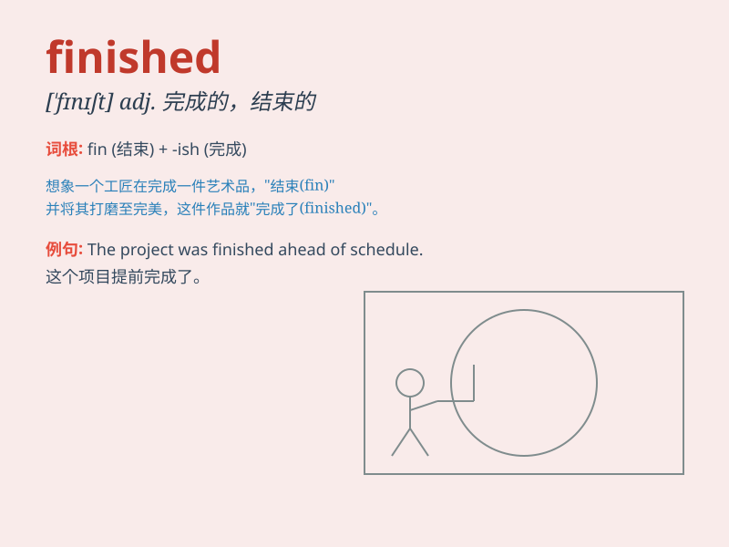

## finished

**英音:** _[\'fɪnɪʃt]_ **美音:** _[\'fɪnɪʃt]_

**译义:** *adj.完成的,完结的,完美的,精巧的*

### 短语

+ **finished product:** _成品；制成品_

+ **finished work:** _已完成的工作_

+ **finished goods:** _制成品；产成品_

+ **be finished with:** _完成；结束；与\...断绝关系_

+ **finished surface:** _精加工表面；光面_

### 例句

#### 例句1

> **I have finished my homework.**

**中文翻译:** 我已经完成了我的家庭作业。

**单词释义:** 完成

#### 例句2

> **He finished the race in first place.**

**中文翻译:** 他以第一名的成绩完成了比赛。

**单词释义:** 完成

#### 例句3

> **When she finished speaking, there was a moment of silence.**

**中文翻译:** 当她讲完时，有一阵沉默。

**单词释义:** 结束

### 背诵小故事

> A little monkey was given a task to build a tower. After working hard
for a long time, it finally completed the tower and shouted, \'I\'m
finished!\' meaning the task was done.

**一只小猴子被分配了建造一座塔的任务。经过长时间的努力工作，它终于建成了塔，并喊道：'我完成了！'
这里的'finished'意思就是任务结束了。**

### 图义

