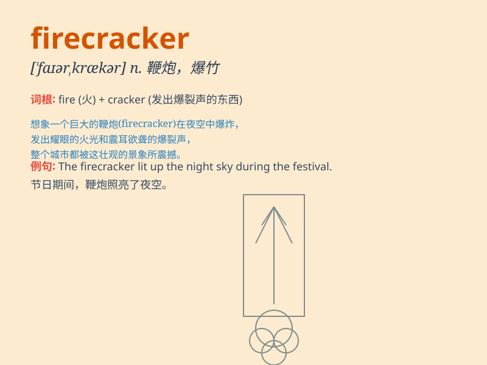

## firecracker

**英音:** _[\'faɪəkrækə]_ **美音:** _[\'faɪɚkrækɚ]_

**译义:** *n.爆竹,鞭炮*

### 短语

+ **set off firecrackers:** _放鞭炮_

+ **light firecrackers:** _点燃鞭炮_

+ **firecracker explosion:** _鞭炮爆炸_

+ **firecracker noise:** _鞭炮声_

+ **traditional firecrackers:** _传统鞭炮_

### 例句

#### 例句1

> **The children were excited to light the firecrackers on New
Year\'s Eve.**

**中文翻译:** 孩子们在除夕夜兴奋地点燃鞭炮。

**单词释义:** 鞭炮

#### 例句2

> **It is illegal to set off firecrackers in the city center.**

**中文翻译:** 在市中心燃放鞭炮是违法的。

**单词释义:** 鞭炮

#### 例句3

> **The sound of firecrackers scared the dog.**

**中文翻译:** 鞭炮声吓到了狗。

**单词释义:** 鞭炮

### 背诵小故事

> One day, a little boy was very excited. He held a firecracker in his
hand. When he lit it, there was a loud bang! It was so thrilling. But be
careful with firecrackers, they can be dangerous.

**有一天，一个小男孩非常兴奋。他手里拿着一个爆竹。当他点燃它时，砰的一声巨响！太刺激了。但要小心爆竹，它们可能很危险。**

### 图义

