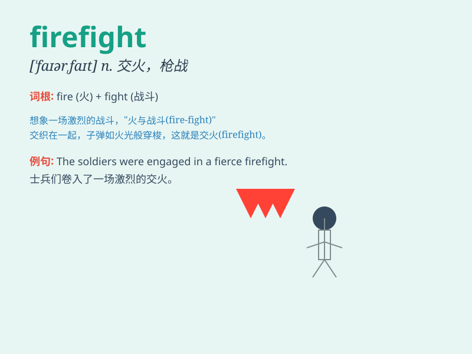

## firefight

**英音:** _[\'faɪəfaɪt]_ **美音:** _[\'faɪɚfaɪt]_

**译义:** *n.[军]交火,火战,炮战*

### 短语

+ **engage in a firefight:** _参与战斗_

+ **survive a firefight:** _在战斗中幸存_

+ **break out a firefight:** _爆发战斗_

+ **win a firefight:** _赢得战斗_

+ **lose a firefight:** _输掉战斗_

### 例句

#### 例句1

> **The soldiers were engaged in a fierce firefight with the
enemy.**

**中文翻译:** 士兵们与敌人进行了一场激烈的交火。

**单词释义:** 交火；战斗

#### 例句2

> **The police found themselves in the middle of a dangerous
firefight during the operation.**

**中文翻译:** 在行动中，警察发现自己陷入了危险的交火之中。

**单词释义:** 枪战；火力冲突

#### 例句3

> **The firefight lasted for several hours before the situation was
under control.**

**中文翻译:** 这场交火持续了几个小时，局势才得到控制。

**单词释义:** 战斗；交火

### 背诵小故事

> A brave soldier was in a dangerous situation during a firefight.
Enemies were shooting, but he remained calm and fought back bravely. The
firefight was intense, but he protected his comrades.

**一位勇敢的士兵在一场交火中处于危险的境地。敌人在射击，但他保持冷静并勇敢地回击。这场交火很激烈，但他保护了他的战友。**

### 图义

