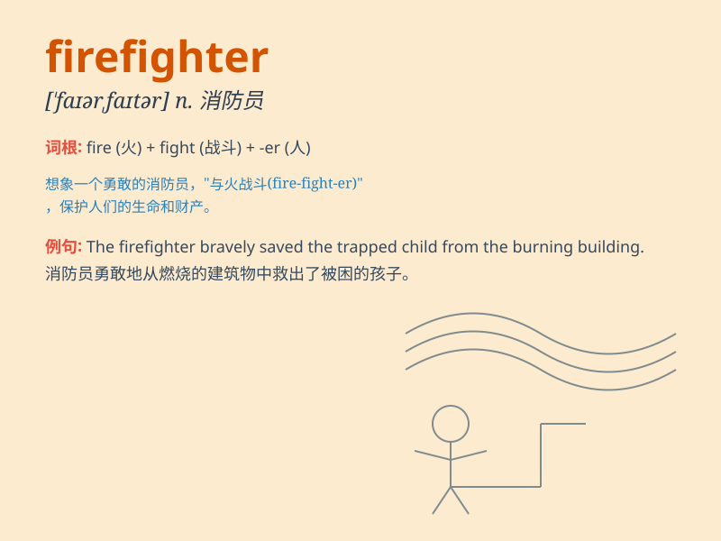

## firefighter

**英音:** _[ˈfaɪəˌfaɪtə]_ **美音:** _[ˈfaɪərˌfaɪtər]_

**译义:** *n. 消防队员，消防员*

### 短语

+ **professional firefighter:** _职业消防员_

+ **volunteer firefighter:** _志愿消防员_

+ **experienced firefighter:** _经验丰富的消防员_

+ **trainee firefighter:** _实习消防员_

+ **retired firefighter:** _退休的消防员_

### 例句

#### 例句1

> **The firefighter bravely entered the burning building to rescue
the trapped people.**

**中文翻译:** 这位消防员勇敢地进入燃烧的大楼去营救被困人员。

**单词释义:** 消防员

#### 例句2

> **My brother is a firefighter and he is always ready to help in
emergencies.**

**中文翻译:** 我的哥哥是一名消防员，他总是准备好在紧急情况下帮忙。

**单词释义:** 消防员

#### 例句3

> **The firefighter used the hose to put out the fire.**

**中文翻译:** 这名消防员用消防水管来灭火。

**单词释义:** 消防员

### 背诵小故事

> One day, there was a big fire. Everyone was scared. But the brave
firefighter came quickly. He wore a helmet and carried a hose. He fought
the fire bravely and saved many people.

**有一天，发生了一场大火。每个人都很害怕。但是勇敢的消防员很快就来了。他戴着头盔，拿着水管。他勇敢地灭火并救了很多人。**

### 图义

