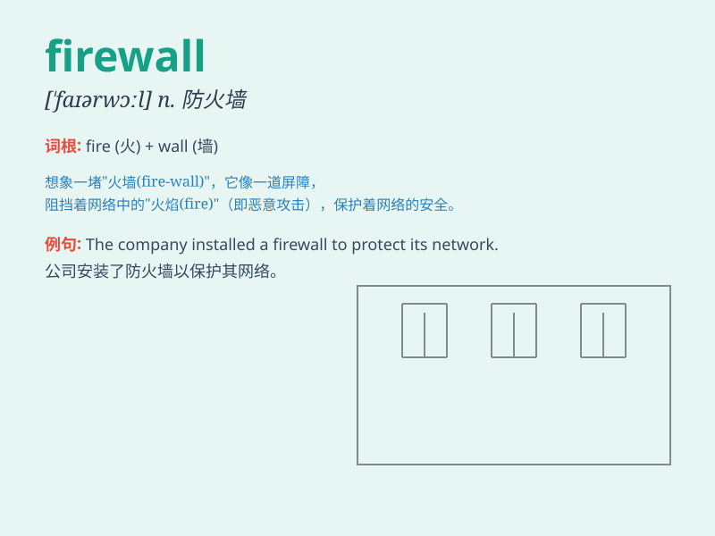

## firewall

**英音:** _[ˈfaɪəwɔːl]_ **美音:** _[ˈfaɪərwɔːl]_

**译义:** *Internet防火墙*

### 短语

+ **network firewall:** _网络防火墙_

+ **firewall protection:** _防火墙保护_

+ **software firewall:** _软件防火墙_

+ **enterprise firewall:** _企业防火墙_

+ **firewall rules:** _防火墙规则_

### 例句

#### 例句1

> **The company\'s network is protected by a powerful firewall.**

**中文翻译:** 公司的网络由一个强大的防火墙保护着。

**单词释义:** 防火墙

#### 例句2

> **We need to upgrade our firewall to prevent cyber attacks.**

**中文翻译:** 我们需要升级我们的防火墙以防止网络攻击。

**单词释义:** 防火墙

#### 例句3

> **The firewall blocked the unauthorized access to our system.**

**中文翻译:** 防火墙阻止了对我们系统的未授权访问。

**单词释义:** 防火墙

### 背诵小故事

>
想象一下，你的房子是一台电脑，而外面的世界充满了各种危险的'火焰'。防火墙（firewall）就像一堵坚固的墙，把这些'火焰'阻挡在外面，保护着房子里的一切，让你的电脑安全无忧。

**想象一下，你的房子是一台电脑，外面世界的危险如同火焰。防火墙就像坚固的墙，阻挡火焰，保护电脑安全。**

### 图义

