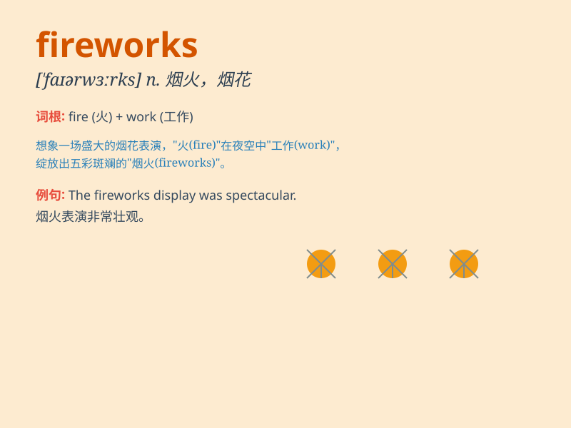

## fireworks

**英音:** _[\'faɪəwɜ:ks]_ **美音:** _[\'faɪr,wɝks]_

**译义:** *n.烟火,激烈争论*

### 短语

+ **set off fireworks:** _放烟花_

+ **fireworks display:** _烟花表演_

+ **colourful fireworks:** _色彩缤纷的烟花_

+ **spectacular fireworks:** _壮观的烟花_

+ **enjoy the fireworks:** _欣赏烟花_

### 例句

#### 例句1

> **The fireworks display was spectacular on New Year\'s Eve.**

**中文翻译:** 除夕夜的烟花表演非常壮观。

**单词释义:** 烟花

#### 例句2

> **We set off fireworks to celebrate the wedding.**

**中文翻译:** 我们放烟花来庆祝婚礼。

**单词释义:** 烟花

#### 例句3

> **The children were excited to see the fireworks in the sky.**

**中文翻译:** 孩子们看到天空中的烟花很兴奋。

**单词释义:** 烟花

### 背诵小故事

> One night, I was walking in the park. Suddenly, there were beautiful
fireworks in the sky. They were colorful and bright, like stars falling.
The scene was so amazing that I\'ll never forget. Fireworks make people
happy and excited.

**一天晚上，我在公园散步。突然，天空中有美丽的烟花。它们色彩斑斓又明亮，像星星坠落。那场景太令人惊叹了，我永远不会忘记。烟花让人开心和兴奋。**

### 图义

