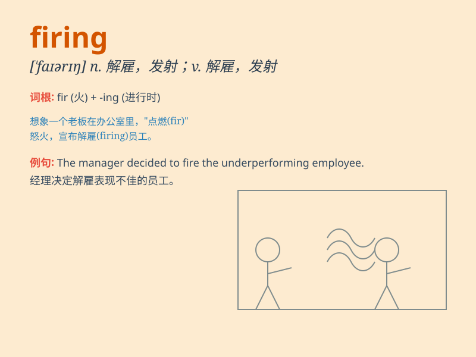

## firing

**英音:** _[\'faɪərɪŋ]_ **美音:** _[\'faɪərɪŋ]_

**译义:** *n.开火,生火,烧窑,烘烤*

### 短语

+ **firing line:**
_射击线；火线；处于容易受到批评（或攻击）的地位_

+ **firing squad:** _行刑队_

+ **firing pin:** _撞针；击针_

+ **firing range:** _射击场；射程_

+ **firing order:** _点火次序；射击顺序_

### 例句

#### 例句1

> **The firing of the gun startled everyone.**

**中文翻译:** 枪声惊吓到了每个人。

**单词释义:** 开枪；射击

#### 例句2

> **The boss is considering the firing of several employees due to
poor performance.**

**中文翻译:** 由于表现不佳，老板正在考虑解雇几名员工。

**单词释义:** 解雇；开除

#### 例句3

> **The firing of pottery requires high temperatures.**

**中文翻译:** 烧制陶器需要高温。

**单词释义:** 烧制；焙烧

### 背诵小故事

> In a factory, the workers were nervously waiting for the firing of
the new machine. It was a crucial moment. When the switch was turned on,
the machine started working smoothly, and everyone cheered. The
\'firing\' here means starting or activating.

**在一家工厂里，工人们紧张地等待新机器的启动。这是关键时刻。当开关打开，机器顺利运转起来，大家都欢呼起来。这里的'firing'指的是启动、开动。**

### 图义

