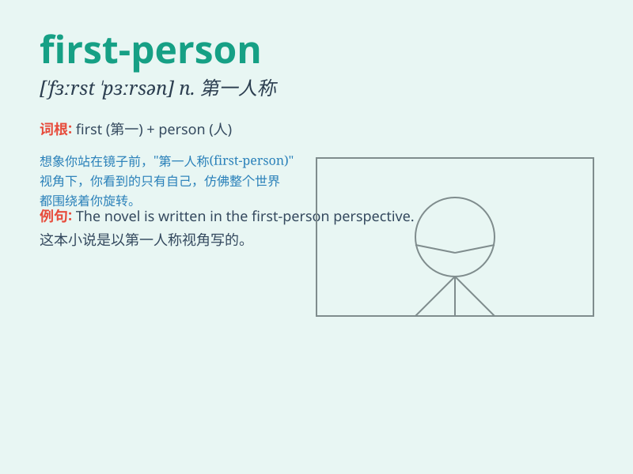

## first-person

**英音:** _[fɜːst-ˈpɜːrsn]_ **美音:** _[fɜːrst-ˈpɜrsn]_

**译义:** *adj.
第一人称的；指说话者本人的（语法术语，与第二人称或第三人称相对）*

### 短语

+ **first-person narrative:** _第一人称叙述_

+ **first-person perspective:** _第一人称视角_

+ **first-person shooter:** _第一人称射击游戏_

+ **first-person account:** _第一人称描述_

+ **first-person story:** _第一人称故事_

### 例句

#### 例句1

> **The novel is written in a first-person narrative.**

**中文翻译:** 这部小说是以第一人称叙述的。

**单词释义:** 第一人称的

#### 例句2

> **She prefers first-person shooters when it comes to video
games.**

**中文翻译:** 说到电子游戏，她更喜欢第一人称射击游戏。

**单词释义:** 第一人称的

#### 例句3

> **The first-person account of the accident was very vivid.**

**中文翻译:** 对事故的第一人称描述非常生动。

**单词释义:** 第一人称的

### 背诵小故事

> One day, a little writer was confused about how to start a story.
Then, an idea popped into his head: \'Let\'s use a first-person
perspective!\' So, he began the story as if he was the main character,
and it became very engaging.

**有一天，一位小作家对如何开始一个故事感到困惑。然后，一个想法突然出现在他的脑海中：'让我们使用第一人称视角！'于是，他以自己为主角开始了这个故事，变得非常引人入胜。**

### 图义

