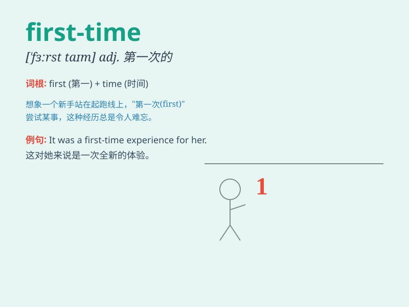

## first-time

**英音:** _[fɜːrstˈtaɪm]_ **美音:** _[fɜːrstˈtaɪm]_

**译义:**
*adj.首次的；第一次的（表示某事是第一次发生或某人第一次经历）*

### 短语

+ **first-time buyer:** _首次购买者_

+ **first-time offender:** _初犯_

+ **first-time parent:** _初为人父母者_

+ **first-time visitor:** _首次访客_

+ **first-time user:** _首次用户_

### 例句

#### 例句1

> **This is my first-time visit to Paris.**

**中文翻译:** 这是我第一次去巴黎。

**单词释义:** 第一次

#### 例句2

> **The first-time experience of skydiving was thrilling.**

**中文翻译:** 第一次跳伞的经历令人兴奋。

**单词释义:** 第一次

#### 例句3

> **She\'s a first-time mother and is still learning.**

**中文翻译:** 她是第一次当母亲，还在学习。

**单词释义:** 第一次

### 背诵小故事

> A young girl was going on a trip for the first-time. She was very
nervous but also excited. When she arrived at the destination, she
realized that first-time experiences can be wonderful and full of
surprises.

**一个年轻女孩第一次去旅行。她非常紧张但也很兴奋。当她到达目的地时，她意识到第一次的经历可以很美妙并且充满惊喜。**

### 图义

