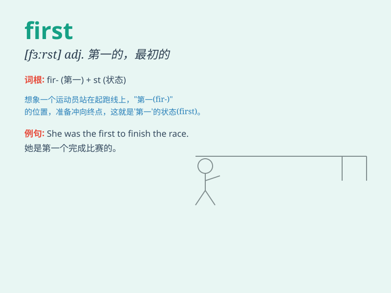

## first

**英音:** _[fɜːst]_ **美音:** _[fɝst]_

**译义:** *adv.首先,最初,第一(列举条目等用),优先adj.第一的
num.第一(个)n.开始,第一,(比赛)冠军*

### 短语

+ **first aid:** _急救_

+ **first class:** _头等舱；一流的_

+ **first name:** _名字_

+ **at first:** _起初；起先_

+ **first of all:** _首先_

### 例句

#### 例句1

> **He came first in the race.**

**中文翻译:** 他在赛跑中得了第一名。

**单词释义:** 第一

#### 例句2

> **This is my first time to visit Beijing.**

**中文翻译:** 这是我第一次来北京。

**单词释义:** 第一次

#### 例句3

> **You should do the first task first.**

**中文翻译:** 你应该先做第一个任务。

**单词释义:** 第一个

### 背诵小故事

> A little rabbit was the first to reach the big carrot in the garden.
It was so happy because it was the fastest. Remember, \'first\' means
coming before all others.

**一只小兔子第一个到达花园里的大胡萝卜那里。它非常开心，因为它是最快的。记住，'first'意思是在所有其他之前。**

### 图义

