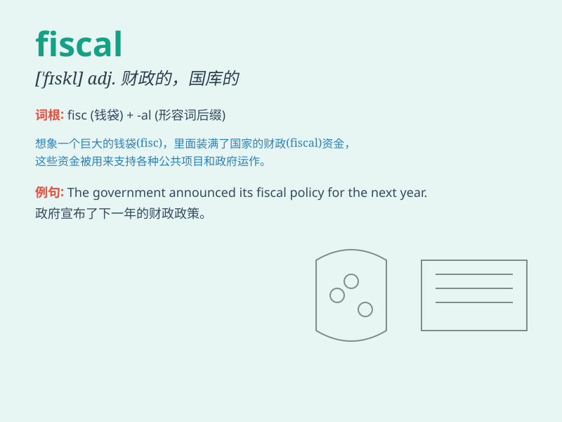

## fiscal

**英音:** _[\'fɪsk(ə)l]_ **美音:** _[\'fɪskl]_

**译义:**
*adj.财政的,国库的,会计的,国库岁入的n.(苏格兰和欧洲某些国家的)检查官,印花税票*

### 短语

+ **fiscal policy:** _财政政策_

+ **fiscal year:** _财政年度；会计年度_

+ **fiscal deficit:** _财政赤字_

+ **fiscal discipline:** _财政纪律_

+ **fiscal stimulus:** _财政刺激_

### 例句

#### 例句1

> **The government is facing fiscal challenges due to the economic
downturn.**

**中文翻译:** 由于经济衰退，政府正面临财政挑战。

**单词释义:** 财政的；财政方面的

#### 例句2

> **The fiscal year ends in March.**

**中文翻译:** 财政年度在三月结束。

**单词释义:** 财政的；财政年度的

#### 例句3

> **We need to adopt a more responsible fiscal policy.**

**中文翻译:** 我们需要采取更负责任的财政政策。

**单词释义:** 财政的

### 背诵小故事

>
想象一个财务大臣，他负责管理国家的财政（fiscal）事务。他每天都在计算税收、预算和开支，确保国家的钱用得合理。他的工作就是处理一切与财政相关的事务，所以记住
fiscal 是财政的、财政上的意思。

**想象一位负责管理国家财政事务的大臣，通过他的工作来记住 fiscal
表示财政的、财政上的含义。**

### 图义

