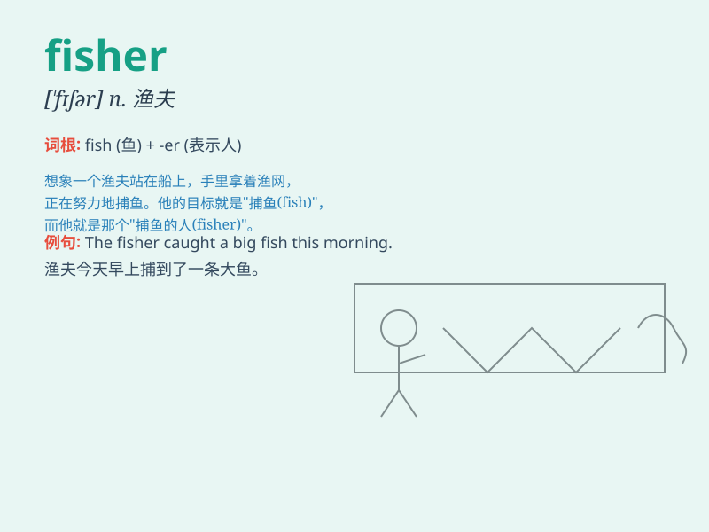

## fisher

**英音:** _[\'fɪʃə]_ **美音:** _[ˈfɪʃər]_

**译义:** *n.渔夫,食鱼动物,渔船,捞取者*

### 短语

+ **fisher folk:** _渔民_

+ **fisher cat:** _渔猫_

+ **fisher girl:** _渔家女_

+ **fisher industry:** _渔业_

+ **fisher boat:** _渔船_

### 例句

#### 例句1

> **The fisher caught a big fish in the river.**

**中文翻译:** 这位渔夫在河里捕到了一条大鱼。

**单词释义:** 渔夫

#### 例句2

> **The life of a fisher is full of challenges and uncertainties.**

**中文翻译:** 渔夫的生活充满了挑战和不确定性。

**单词释义:** 渔夫

#### 例句3

> **She married a fisher and moved to the seaside.**

**中文翻译:** 她嫁给了一位渔夫并搬到了海边。

**单词释义:** 渔夫

### 背诵小故事

> Once upon a time, there was a man named Tom. He loved fishing so much
that people called him \'Fisher\'. Every day, Fisher went to the river,
hoping to catch big fish and enjoy the peace of nature.

**从前，有个叫汤姆的人。他非常喜欢钓鱼，以至于人们都叫他'渔夫'。每天，渔夫都会去河边，希望能钓到大鱼，享受大自然的宁静。**

### 图义

