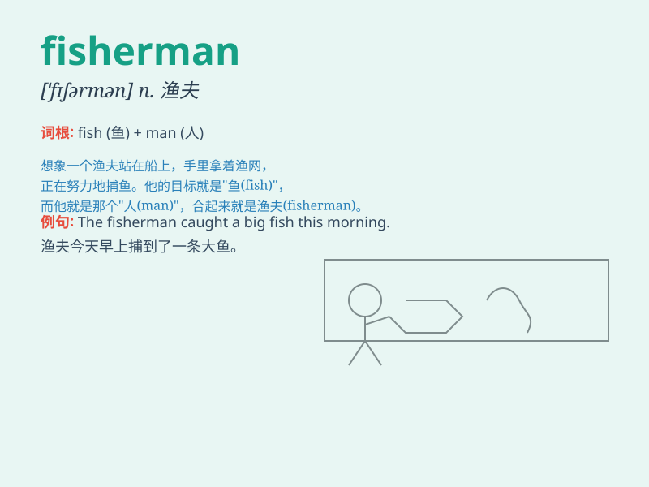

## fisherman

**英音:** _[\'fɪʃəmən]_ **美音:** _[\'fɪʃɚmən]_

**译义:** *n.渔民,渔夫*

### 短语

+ **fisherman\'s knot:** _渔人结（一种绳结）_

+ **fisherman\'s village:** _渔民村_

+ **experienced fisherman:** _经验丰富的渔民_

+ **local fisherman:** _当地渔民_

+ **poor fisherman:** _贫穷的渔民_

### 例句

#### 例句1

> **The fisherman caught a big fish in the river.**

**中文翻译:** 这位渔夫在河里捕到了一条大鱼。

**单词释义:** 渔夫

#### 例句2

> **The old fisherman has been working at sea for decades.**

**中文翻译:** 这位老渔夫已经在海上工作了几十年。

**单词释义:** 渔夫

#### 例句3

> **The fisherman sells his catch at the market every morning.**

**中文翻译:** 这位渔夫每天早上在市场上出售他的捕获物。

**单词释义:** 渔夫

### 背诵小故事

> One day, a fisherman went to the sea very early. He threw his net
patiently and finally caught many big fish. His hard work paid off and
he returned home happily with a full boat.

**一天，一位渔夫很早就去了海边。他耐心地撒网，最终捕到了很多大鱼。他的辛勤付出得到了回报，满心欢喜地载着一船鱼回家了。**

### 图义

