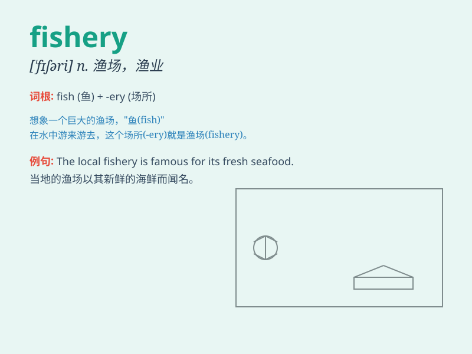

## fishery

**英音:** _[\'fɪʃ(ə)rɪ]_ **美音:** _[\'fɪʃəri]_

**译义:** *n.渔业,水产业,渔场,养鱼术*

### 短语

+ **commercial fishery:** _商业渔业_

+ **marine fishery:** _海洋渔业_

+ **inshore fishery:** _近海渔业_

+ **freshwater fishery:** _淡水渔业_

+ **artisanal fishery:** _个体渔业_

### 例句

#### 例句1

> **The local fishery provides fresh seafood to the market.**

**中文翻译:** 当地的渔业为市场提供新鲜的海鲜。

**单词释义:** 渔业

#### 例句2

> **They went to a fishery to buy some fish.**

**中文翻译:** 他们去了一家渔场买一些鱼。

**单词释义:** 渔场

#### 例句3

> **The government is taking measures to protect the fishery
resources.**

**中文翻译:** 政府正在采取措施保护渔业资源。

**单词释义:** 渔业

### 背诵小故事

> Once upon a time, Tom went to a place called \'fishery\'. There,
people caught many fish and sold them. Tom saw big nets and boats. He
understood that a fishery is where fish are caught and sold.

**从前，汤姆去了一个叫'渔场'的地方。在那里，人们捕了很多鱼并出售。汤姆看到了大网和船只。他明白了渔场就是捕鱼和卖鱼的地方。**

### 图义

