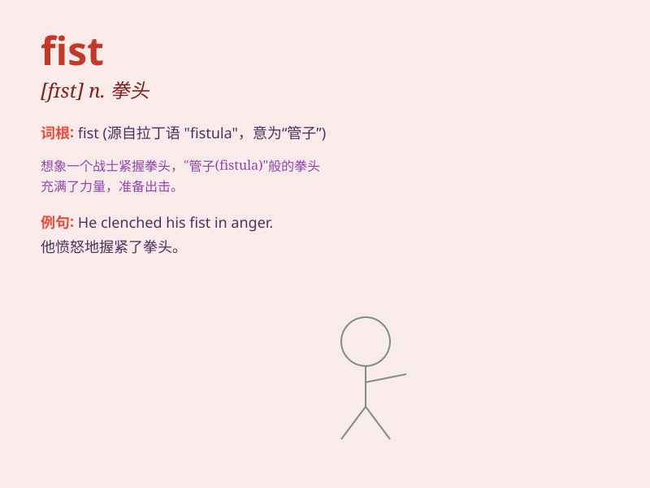

## fist

**英音:** _[fɪst]_ **美音:** _[fɪst]_

**译义:** *n.拳头,手,抓住,抓牢vt.拳打,握成拳,紧握*

### 短语

+ **clench one\'s fist:** _握紧拳头_

+ **shake one\'s fist:** _挥舞拳头_

+ **raise one\'s fist:** _举起拳头_

+ **make a fist:** _握拳_

+ **fist fight:** _拳斗；互殴_

### 例句

#### 例句1

> **He clenched his fist in anger.**

**中文翻译:** 他愤怒地握紧了拳头。

**单词释义:** 拳头

#### 例句2

> **She hit him with her fist.**

**中文翻译:** 她用拳头打他。

**单词释义:** 拳头

#### 例句3

> **The boxer raised his fist in victory.**

**中文翻译:** 拳击手举起拳头表示胜利。

**单词释义:** 拳头

### 背诵小故事

> One day, a thief broke into a house. The owner was very brave and
raised his fist to fight the thief. With his strong fist, he scared the
thief away. Remember, a fist is a closed hand ready for action.

**有一天，一个小偷闯进了一所房子。房子的主人非常勇敢，举起他的拳头与小偷搏斗。凭借他有力的拳头，他把小偷吓跑了。记住，fist
就是指握紧准备出击的手。**

### 图义

