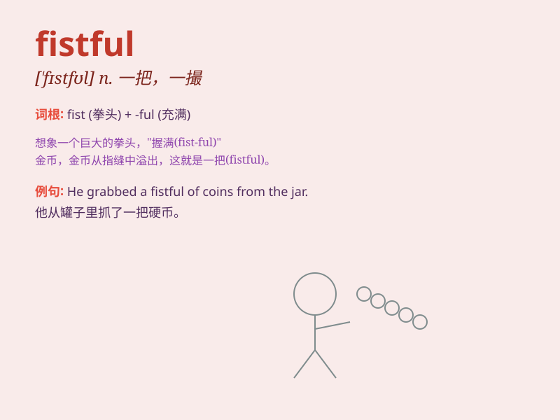

## fistful

**英音:** _[\'fɪstfʊl]_ **美音:** _[\'fɪstfʊl]_

**译义:** *n.一撮,一把*

### 短语

+ **a fistful of flowers:** _一把花_

+ **a fistful of sand:** _一把沙子_

+ **a fistful of coins:** _一把硬币_

+ **a fistful of grass:** _一把草_

+ **a fistful of stones:** _一把石头_

### 例句

#### 例句1

> **He grabbed a fistful of sand and threw it into the air.**

**中文翻译:** 他抓起一把沙子，扔到空中。

**单词释义:** 一把（量）

#### 例句2

> **She held a fistful of flowers in her hand.**

**中文翻译:** 她手里拿着一把鲜花。

**单词释义:** 一把（量）

#### 例句3

> **The child came back with a fistful of candies.**

**中文翻译:** 孩子回来了，手里拿着一把糖果。

**单词释义:** 一把（量）

### 背诵小故事

> A poor boy was always hungry. One day, he found a bag with a fistful
of coins. He was so happy as it could buy him food. With his closed fist
holding the coins tightly, he rushed to the market.

**一个贫穷的男孩总是挨饿。有一天，他发现了一个袋子，里面有满满一把硬币。他非常高兴，因为这可以给他买食物。他紧紧地握着拳头里的硬币，冲向了市场。**

### 图义

