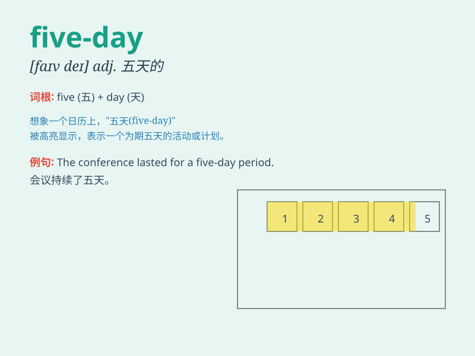

## five-day

**英音:** _[faɪv deɪ]_ **美音:** _[faɪv deɪ]_

**译义:** *adj. 五天的；持续五天的*

### 短语

+ **five-day holiday:** _五天的假期_

+ **five-day workweek:** _五天工作制_

+ **five-day event:** _为期五天的活动_

+ **five-day trip:** _五天的旅行_

+ **five-day course:** _五天的课程_

### 例句

#### 例句1

> **We are going on a five-day trip to the mountains.**

**中文翻译:** 我们要去山里进行为期五天的旅行。

**单词释义:** 为期五天的

#### 例句2

> **The five-day training course was very useful.**

**中文翻译:** 这个为期五天的培训课程非常有用。

**单词释义:** 为期五天的

#### 例句3

> **She took a five-day vacation to relax.**

**中文翻译:** 她休了五天的假来放松。

**单词释义:** 五天的

### 背诵小故事

> Imagine a little adventurer who goes on a five-day journey. Each day
brings new experiences. On the first day, he sees beautiful mountains.
The second day, he meets friendly animals. The third day, he discovers a
hidden cave. The fourth day, he enjoys a starry night. And on the fifth
day, he returns home with wonderful memories.

**想象一个小冒险家进行了为期五天的旅程。每一天都带来新的体验。第一天，他看到了美丽的山。第二天，他遇到了友好的动物。第三天，他发现了一个隐藏的洞穴。第四天，他享受了繁星满天的夜晚。第五天，他带着美好的回忆回家。**

### 图义

