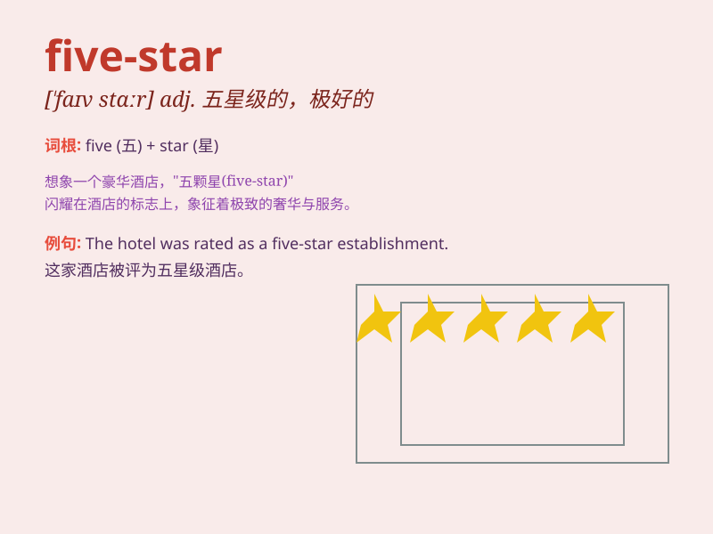

## five-star

**英音:** _[faɪv stɑː]_ **美音:** _[faɪv stɑr]_

**译义:** *adj.五星级的；一流的；五星的*

### 短语

+ **five-star hotel:** _五星级酒店_

+ **five-star service:** _五星级服务_

+ **five-star general:** _五星上将_

+ **five-star rating:** _五星评级_

+ **five-star quality:** _五星品质_

### 例句

#### 例句1

> **The hotel is a five-star establishment with top-notch
service.**

**中文翻译:** 这家酒店是一家五星级的场所，有着一流的服务。

**单词释义:** 五星级的

#### 例句2

> **She received a five-star review for her performance.**

**中文翻译:** 她的表演获得了五星评价。

**单词释义:** 五星的

#### 例句3

> **The five-star restaurant is famous for its exquisite cuisine.**

**中文翻译:** 这家五星级餐厅因其精致的菜肴而闻名。

**单词释义:** 五星级的

### 背诵小故事

> Once upon a time, a traveler was lost and needed a place to stay. He
found a five-star hotel. It had big rooms, delicious food, and friendly
staff. He had a wonderful time and always remembered the five-star
experience.

**从前，一位旅行者迷路了需要找个地方住。他发现了一家五星级酒店。那里有大房间、美味的食物和友好的员工。他度过了一段美妙的时光，并永远记住了这五星级的体验。**

### 图义

