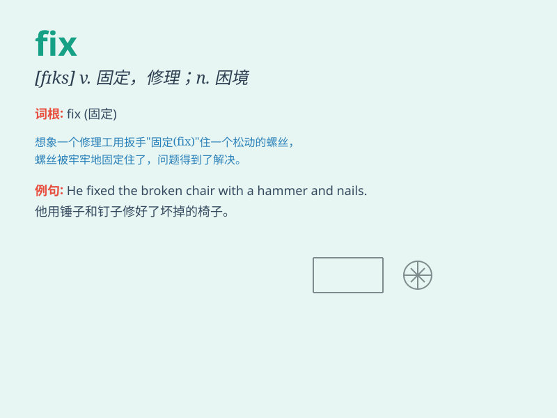

## fix

**英音:** _[fɪks]_ **美音:** _[fɪks]_

**译义:**
*vt.使固定,装置,修理,准备,安装,凝视,整理,牢记vi.固定,注视,决定,选定,确定n.困境,方位,贿赂*

### 短语

+ **fix up:** _修理；装饰；安排_

+ **fix on:** _确定；选定；专注于_

+ **fix in:** _安装；嵌入_

+ **fix one\'s eyes on:** _注视；盯着看_

+ **fix a date:** _确定日期_

### 例句

#### 例句1

> **I need to fix the broken chair.**

**中文翻译:** 我需要修理坏掉的椅子。

**单词释义:** 修理

#### 例句2

> **Let\'s fix a date for the meeting.**

**中文翻译:** 我们来确定一下会议的日期吧。

**单词释义:** 确定，决定

#### 例句3

> **He tried to fix the problem, but failed.**

**中文翻译:** 他试图解决这个问题，但失败了。

**单词释义:** 解决

### 背诵小故事

> One day, my bike was broken. I was very worried. But my father came
and said he could fix it. He spent some time and finally made my bike
work again. I was so happy!

**有一天，我的自行车坏了。我很担心。但我爸爸过来说他能修好它。他花了一些时间，最终让我的自行车又能骑了。我非常开心！**

### 图义

