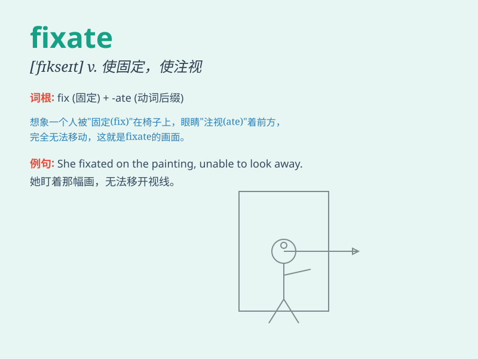

## fixate

**英音:** _[fɪk\'seɪt]_ **美音:** _[\'fɪkset]_

**译义:** *vi.视线移向,注视vt.使固定,注视,凝视,集中(眼)力*

### 短语

+ **fixate on:** _全神贯注于；凝视；注视_

+ **be fixated with:** _痴迷于；执着于_

+ **fixate one\'s attention:** _集中注意力_

+ **fixate the mind:** _使心思专注_

+ **fixate upon something:** _把注意力固定在某物上_

### 例句

#### 例句1

> **He tends to fixate on small details and ignore the big
picture.**

**中文翻译:** 他倾向于关注小细节而忽视大局。

**单词释义:** 专注于

#### 例句2

> **Her eyes fixated on the distant mountain.**

**中文翻译:** 她的目光注视着远处的山峰。

**单词释义:** 凝视

#### 例句3

> **Don\'t fixate on your mistakes; learn from them and move on.**

**中文翻译:** 不要纠缠于自己的错误；向他们学习并继续前进。

**单词释义:** 老是想着

### 背诵小故事

> Once upon a time, a little boy was fixated on a toy car. He couldn\'t
take his eyes off it. His mind was completely focused on getting that
car. \'Fixate\' means to focus one\'s attention firmly and fixedly.

**从前，有个小男孩专注于一辆玩具车。他的目光无法从它身上移开。他的心思完全集中在得到那辆车上面。'fixate'意思是使（目光、心思等）固定于某物**

### 图义

