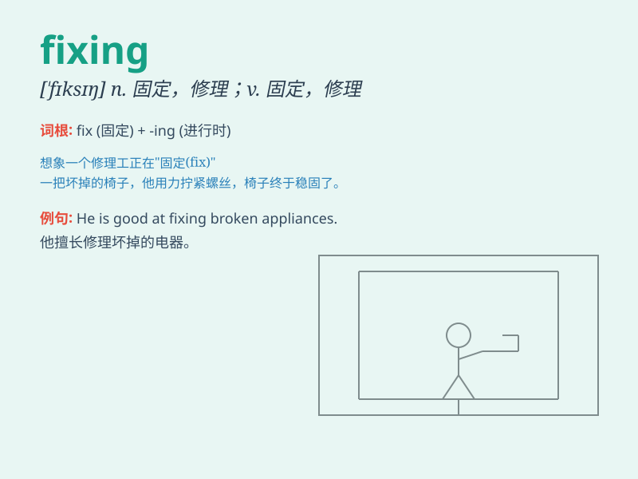

## fixing

**英音:** _[\'fɪksɪŋ]_ **美音:** _[\'fɪksɪŋ]_

**译义:** *n.固定,稳固,设备,安装,修理,调料*

### 短语

+ **fixing up:** _修理；装饰；准备_

+ **fixing point:** _固定点；定位点_

+ **fixing device:** _固定装置_

+ **fixing screw:** _固定螺丝_

+ **fixing cost:** _固定成本_

### 例句

#### 例句1

> **I\'m fixing the broken chair.**

**中文翻译:** 我正在修理坏掉的椅子。

**单词释义:** 修理

#### 例句2

> **She is fixing her hair in the mirror.**

**中文翻译:** 她正在对着镜子整理头发。

**单词释义:** 整理

#### 例句3

> **They are fixing the date for the meeting.**

**中文翻译:** 他们正在确定会议日期。

**单词释义:** 确定

### 背诵小故事

> One day, my bike was broken. I spent the whole afternoon fixing it.
Finally, it was as good as new. Fixing things can be challenging but
rewarding.

**有一天，我的自行车坏了。我花了整个下午修理它。最后，它完好如新。修理东西可能具有挑战性但也很有收获。**

### 图义

