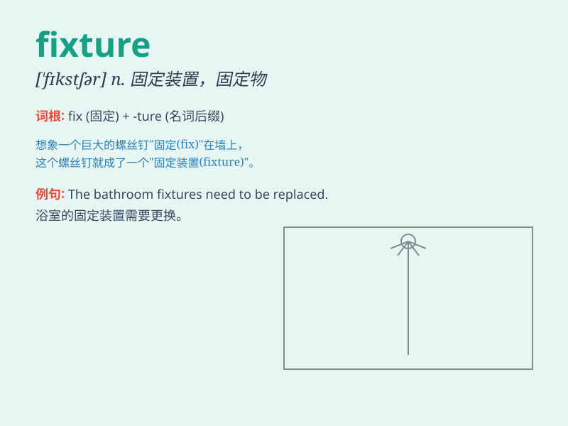

## fixture

**英音:** _[\'fɪkstʃə; -tjə]_ **美音:** _[\'fɪkstʃɚ]_

**译义:** *n.固定设备,预定日期,比赛时间,[机]装置器,工作夹具*

### 短语

+ **fixture list:** _比赛日程表_

+ **bathroom fixture:** _浴室固定装置_

+ **fixture schedule:** _固定装置的时间表_

+ **lighting fixture:** _照明灯具_

+ **fixture design:** _固定装置设计_

### 例句

#### 例句1

> **The football match was postponed due to a problem with the
fixture.**

**中文翻译:** 由于赛程问题，足球比赛被推迟。

**单词释义:** （体育比赛等的）固定装置；固定设施

#### 例句2

> **The new light fixture in the living room looks very modern.**

**中文翻译:** 客厅里的新灯具看起来非常现代。

**单词释义:** （房屋等的）固定装置，固定设备

#### 例句3

> **The fixture list for the upcoming season has been released.**

**中文翻译:** 下赛季的赛程表已经出炉。

**单词释义:** 预定日期的体育比赛；预定的活动

### 背诵小故事

>
想象一个足球比赛，赛前大家都在讨论场地的固定设施，比如球门、角旗等，这些固定不变的设施就是
\'fixture\'
。它们是比赛中不可或缺的一部分，就像这个单词在某些场景中表示固定的设备或固定的事物一样。

**想象足球比赛中的固定设施来理解'fixture'这个单词，表示固定设备或固定事物**

### 图义

