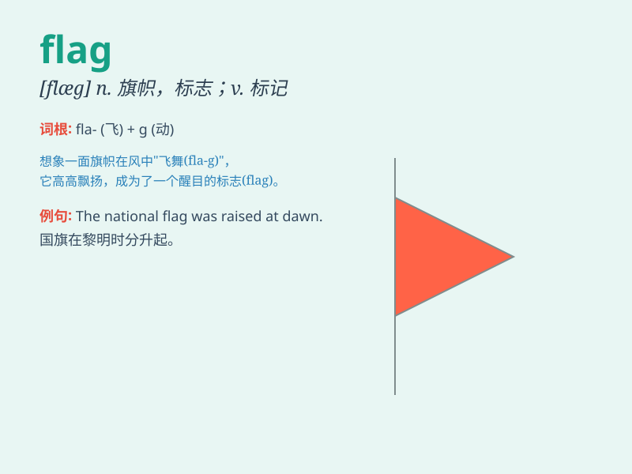

## flag

**英音:** _[flæg]_ **美音:** _[flæg]_

**译义:** *n.旗,标记v.标记*

### 短语

+ **flag down:** _挥手示意（车辆、出租车等）停下_

+ **white flag:** _白旗（表示投降）_

+ **flag pole:** _旗杆_

+ **flag of truce:** _休战旗_

+ **flag someone/something off:** _用旗发出（起跑、开始等）信号_

### 例句

#### 例句1

> **The flag of our country is red and has five stars.**

**中文翻译:** 我国的国旗是红色的，有五颗星。

**单词释义:** 旗帜

#### 例句2

> **The taxi driver flagged me down on the street.**

**中文翻译:** 出租车司机在街上拦住了我。

**单词释义:** 挥手示意

#### 例句3

> **The leaves started to flag in the autumn wind.**

**中文翻译:** 树叶在秋风中开始枯萎。

**单词释义:** 枯萎；衰退

### 背诵小故事

> A brave soldier was on a mission. He saw a flag waving in the
distance. It was the flag of his country, a symbol of hope and victory.
Remember, the flag is a sign that gives direction and inspires.

**一位勇敢的士兵在执行任务。他看到远处飘扬着一面旗帜。那是他国家的旗帜，是希望和胜利的象征。记住，旗帜是给予方向和鼓舞的标志。**

### 图义

