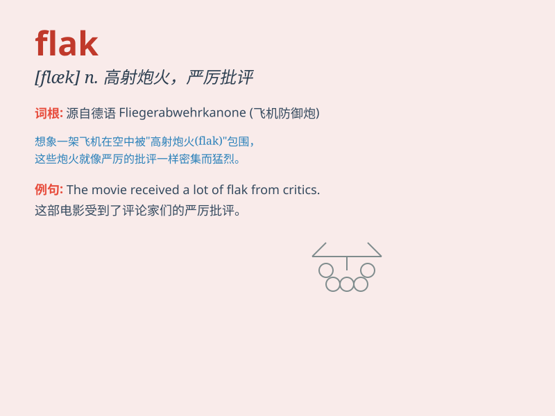

## flak

**英音:** _[flæk]_ **美音:** _[flæk]_

**译义:** *n.高射炮火*

### 短语

+ **catch flak:** _受到严厉批评；遭到抨击_

+ **take flak:** _受到批评；遭到指责_

+ **flak jacket:** _防弹背心_

+ **draw flak:** _引起批评；招来指责_

+ **heavy flak:** _猛烈的批评；强烈的指责_

### 例句

#### 例句1

> **The politician received a lot of flak for his controversial
decision.**

**中文翻译:** 这位政治家因其有争议的决定而受到严厉批评。

**单词释义:** 严厉批评；抨击

#### 例句2

> **The new policy drew flak from all sides.**

**中文翻译:** 新政策遭到各方批评。

**单词释义:** 指责；非难

#### 例句3

> **The pilot had to fly through heavy flak.**

**中文翻译:** 飞行员必须飞过猛烈的高射炮。

**单词释义:** 高射炮火

### 背诵小故事

> In the war, the soldiers were constantly under flak. One brave
soldier named Jack found a way to avoid it. He led his team to safety.
Flak here means intense criticism or strong attack.

**在战争中，士兵们一直遭受着高射炮火的攻击。一位勇敢的士兵杰克找到了躲避的方法，他带领他的队伍到达了安全地带。这里的flak意思是强烈的批评或猛烈的攻击。**

### 图义

