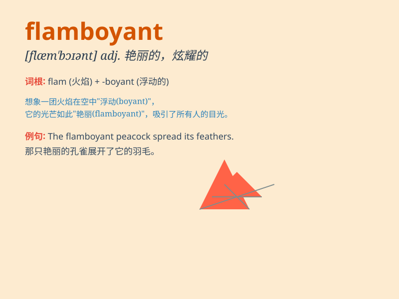

## flamboyant

**英音:** _[flæm\'bɒɪənt]_ **美音:** _[flæm\'bɔɪənt]_

**译义:** *adj.辉耀的,华丽的,火焰似的,艳丽的*

### 短语

+ **flamboyant style:** _华丽的风格_

+ **flamboyant personality:** _张扬的个性_

+ **flamboyant dress:** _艳丽的连衣裙_

+ **flamboyant performance:** _华丽的表演_

+ **flamboyant gesture:** _夸张的手势_

### 例句

#### 例句1

> **The flamboyant singer wore a shiny outfit on stage.**

**中文翻译:** 这位华丽的歌手在舞台上穿着闪亮的服装。

**单词释义:** 华丽张扬的

#### 例句2

> **His flamboyant style of writing made his novels very popular.**

**中文翻译:** 他华丽的文风使他的小说很受欢迎。

**单词释义:** 华丽浮夸的

#### 例句3

> **The flamboyant architecture of the building attracted many
tourists.**

**中文翻译:** 其华丽的建筑风格吸引了众多游客。

**单词释义:** 华丽炫目的

### 背诵小故事

> A prince wore a flamboyant outfit with bright colors and fancy
patterns. Everyone was amazed by his showy look. The prince\'s
flamboyant style made him stand out in the crowd.

**一位王子穿着一套华丽的服装，色彩鲜艳，图案精美。每个人都对他那炫耀的样子感到惊讶。王子华丽的风格使他在人群中脱颖而出。**

### 图义

