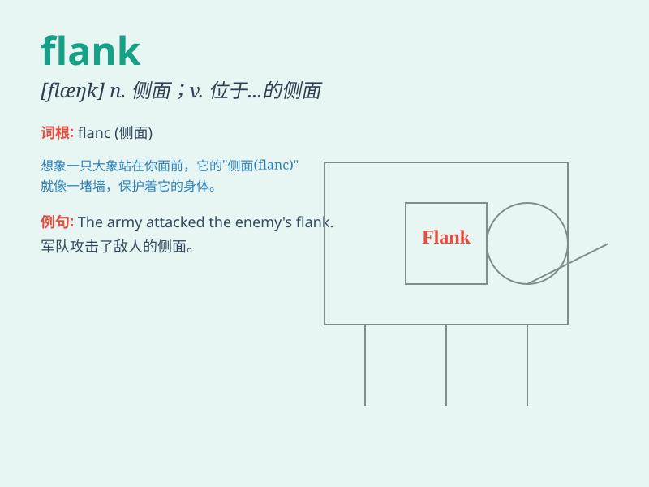

## flank

**英音:** _[flæŋk]_ **美音:** _[flæŋk]_

**译义:**
*n.腰窝,侧面,军队侧翼,侧腹,胁,腰窝肉vt.在\...的侧面,侧翼包围,守侧面vi.侧面与\...相接*

### 短语

+ **on the flank:** _在侧面_

+ **flank attack:** _侧翼攻击_

+ **flank pain:** _侧腹痛_

+ **cover the flank:** _掩护侧翼_

+ **flank speed:** _最高速度_

### 例句

#### 例句1

> **The soldiers protected the flank of the army.**

**中文翻译:** 士兵们保护着军队的侧翼。

**单词释义:** 侧翼；侧面

#### 例句2

> **The house is located on the flank of the mountain.**

**中文翻译:** 房子位于山的一侧。

**单词释义:** 侧面；侧边

#### 例句3

> **The general ordered his troops to attack the enemy\'s flank.**

**中文翻译:** 将军命令他的部队攻击敌人的侧翼。

**单词释义:** 侧翼；侧部

### 背诵小故事

> A soldier was assigned to guard the flank of the army. One night, he
was so alert that he noticed the enemy approaching from the side. Thanks
to him, the army was safe. \'Flank\' means the side of something.

**一名士兵被指派守卫军队的侧翼。一天晚上，他非常警觉，注意到敌人从侧面靠近。多亏了他，军队才安全。\'flank\'意思是某物的侧面。**

### 图义

