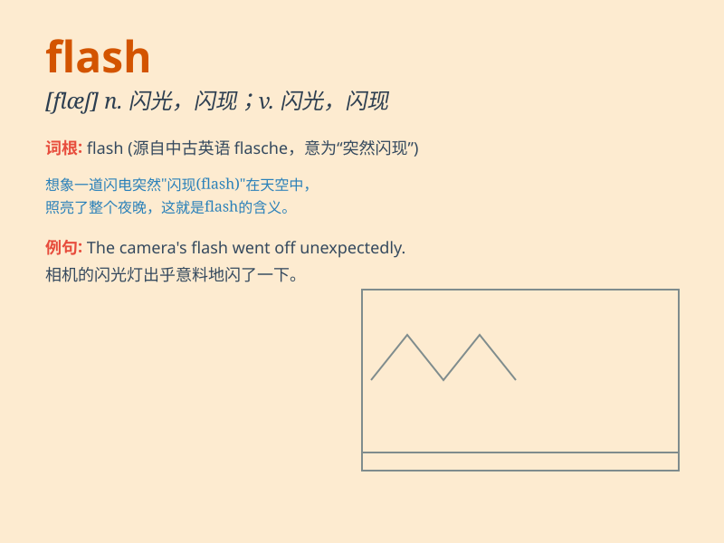

## flash

**英音:** _[flæʃ]_ **美音:** _[flæʃ]_

**译义:**
*n.闪光,闪现,一瞬间;vi.闪光,闪现,反射,使迅速传便;vt.使闪光,反射;adj.闪光的,火速的*

### 短语

+ **flash light:** _手电筒_

+ **flash flood:** _骤发洪水_

+ **flash in the pan:** _昙花一现_

+ **a flash of inspiration:** _灵感的闪现_

+ **flash memory:** _闪存_

### 例句

#### 例句1

> **A flash of lightning lit up the sky.**

**中文翻译:** 一道闪电照亮了天空。

**单词释义:** 闪光；闪烁

#### 例句2

> **The news of his death flashed around the world.**

**中文翻译:** 他去世的消息传遍了全世界。

**单词释义:** 迅速传播

#### 例句3

> **She had a flash of inspiration and solved the problem.**

**中文翻译:** 她灵机一动，解决了这个问题。

**单词释义:** 突然的想法；灵感的闪现

### 背诵小故事

> A thief was running in the dark. Suddenly, a flash of light from a
police car appeared and caught him. The thief was scared and stopped.
The flash helped the police catch the criminal.

**一个小偷在黑暗中奔跑。突然，一辆警车的一道闪光出现并抓住了他。小偷被吓到并停了下来。这道闪光帮助警察抓住了罪犯。**

### 图义

