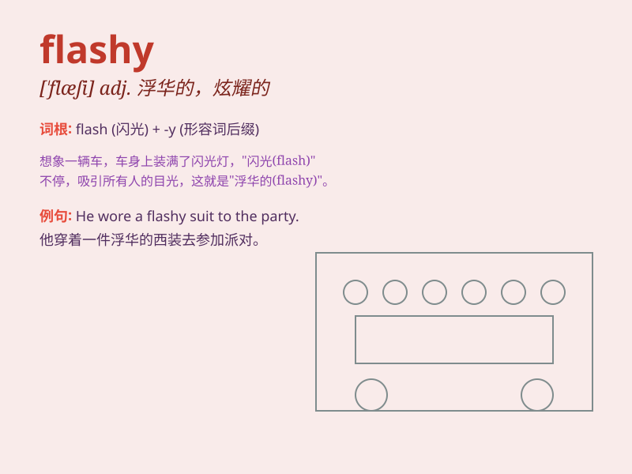

## flashy

**英音:** _[ˈflæʃi]_ **美音:** _[ˈflæʃi]_

**译义:** *adj.浮华的*

### 短语

+ **flashy clothes:** _浮华的衣服_

+ **flashy car:** _花哨的汽车_

+ **flashy jewelry:** _耀眼的珠宝_

+ **flashy style:** _浮华的风格_

+ **flashy appearance:** _浮华的外表_

### 例句

#### 例句1

> **She wore a flashy dress to the party.**

**中文翻译:** 她穿着一件华丽的连衣裙去参加聚会。

**单词释义:** 华丽的；俗艳的

#### 例句2

> **The car had a flashy paint job.**

**中文翻译:** 这辆车的油漆很华丽。

**单词释义:** 花哨的；惹人注目的

#### 例句3

> **His flashy style doesn\'t appeal to me.**

**中文翻译:** 他华丽的风格不吸引我。

**单词释义:** 浮华的；炫耀的

### 背诵小故事

> A peacock was showing off its flashy feathers in the zoo. Everyone
was attracted by its bright and showy colors. It was so flashy that it
stood out among all the other birds.

**一只孔雀在动物园里炫耀它艳丽的羽毛。每个人都被它鲜艳和浮华的颜色所吸引。它是如此艳丽夺目，在所有其他鸟类中脱颖而出。**

### 图义

