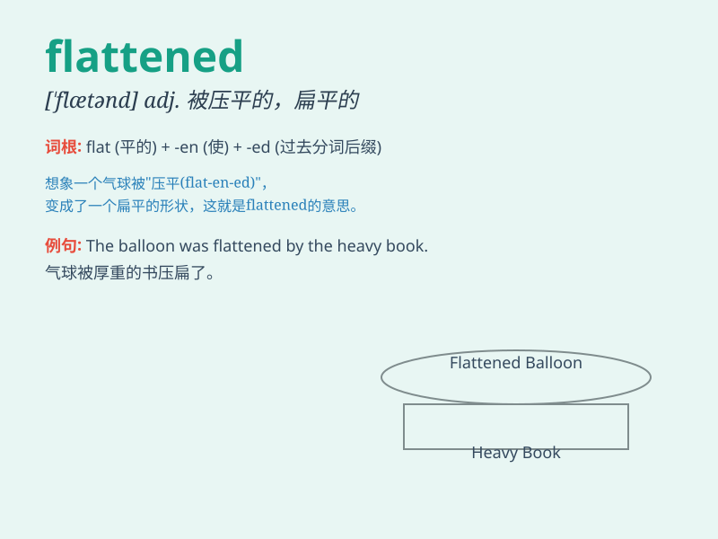

## flattened

**英音:** _[ˈflætnd]_ **美音:** _[ˈflætənd]_

**译义:** *adj. 被压平的；扁平的；平坦的；v. 使变平（flatten
的过去分词）*

### 短语

+ **flattened curve:** _平缓的曲线_

+ **flattened surface:** _平坦的表面_

+ **flattened object:** _扁平的物体_

+ **flattened leaf:** _扁平的叶子_

+ **flattened shape:** _扁平的形状_

### 例句

#### 例句1

> **The earthquake flattened many buildings.**

**中文翻译:** 地震使许多建筑物倒塌了。

**单词释义:** 使变平；摧毁

#### 例句2

> **He flattened the paper to make it easier to store.**

**中文翻译:** 他把纸压平以便更容易存放。

**单词释义:** 使变平

#### 例句3

> **The car flattened the grass as it drove across the field.**

**中文翻译:** 汽车驶过田野时把草压平了。

**单词释义:** 把\...压平

### 背诵小故事

> One day, a little boy was playing with a balloon. But when he sat on
it accidentally, the balloon was flattened. It became completely flat
and lost its round shape. Poor balloon!

**有一天，一个小男孩在玩气球。但当他不小心坐在上面时，气球被压扁了。它变得完全扁平，失去了圆形。可怜的气球！**

### 图义

