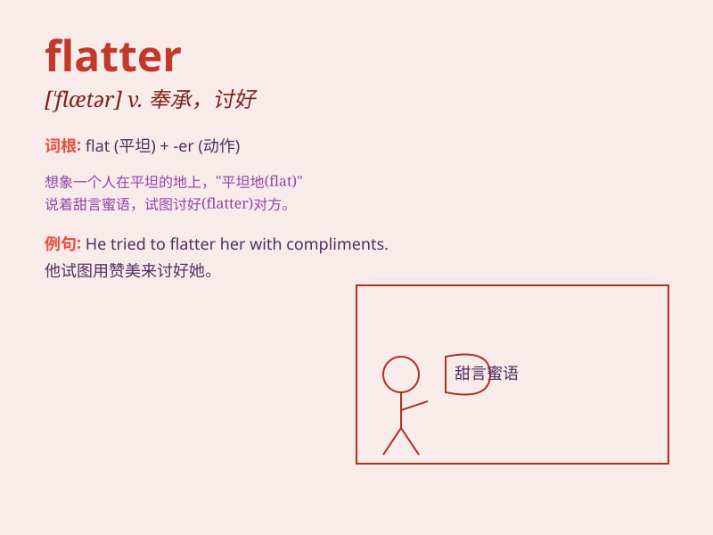

## flatter

**英音:** _[\'flætə]_ **美音:** _[\'flætɚ]_

**译义:**
*vt.过分夸赞,奉承,阿谀,使高兴,使满意,(画,肖像上的形象)胜过(真人或实物)*

### 短语

+ **flatter oneself:** _自以为；自鸣得意_

+ **flatter to deceive:** _看上去不错却不实用；中看不中用_

+ **be flattered by:** _因\...\...而感到荣幸_

+ **flatter sb into doing sth:** _哄骗某人做某事_

+ **flatter with false praise:** _用虚伪的赞扬讨好_

### 例句

#### 例句1

> **She was flattered by his attention.**

**中文翻译:** 她对他的关注感到受宠若惊。

**单词释义:** 使感到荣幸；奉承

#### 例句2

> **The dress flatters her figure.**

**中文翻译:** 这件衣服凸显了她的身材。

**单词释义:** 使显得更漂亮

#### 例句3

> **He flattered himself that he was the best singer in the
group.**

**中文翻译:** 他自以为自己是乐队里最好的歌手。

**单词释义:** 自认为；自以为是

### 背诵小故事

>
有一天，小明参加了一场聚会。聚会上，一位新朋友对小明说了很多赞美之词，小明感到很开心。但后来他发现这位朋友只是为了讨好他以获取好处，这让小明明白这种过分的赞美就是flatter。

**有一天，小明参加聚会，新朋友对他说了很多赞美的话，小明后来发现这只是为讨好他获取好处，这就是'奉承；谄媚；使高兴'的flatter。**

### 图义

