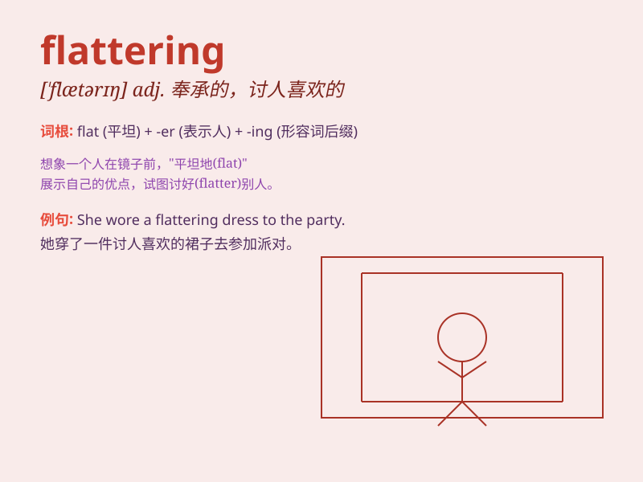

## flattering

**英音:** _[\'flætərɪŋ]_ **美音:** _[\'flætərɪŋ]_

**译义:** *adj.谄媚的,讨人欢喜的,奉承的,(肖像等)比真容更美丽*

### 短语

+ **flattering photo:** _好看的照片_

+ **flattering dress:** _显身材的连衣裙_

+ **flattering comment:** _奉承的话_

+ **flattering light:** _柔和的光线_

+ **flattering mirror:** _有美化效果的镜子_

### 例句

#### 例句1

> **The dress is very flattering on you. **

**中文翻译:** 这件衣服穿在你身上很讨人喜欢。

**单词释义:** 使显得更漂亮

#### 例句2

> **His compliment was flattering but insincere. **

**中文翻译:** 他的恭维是奉承但不真诚。

**单词释义:** 奉承的；讨好的

#### 例句3

> **The photo is flattering; it makes me look much younger. **

**中文翻译:** 照片很漂亮；它让我看起来年轻多了。

**单词释义:** 把...拍得比本人漂亮

### 背诵小故事

> A girl wore a new dress and everyone said she looked beautiful. But
she knew some of the compliments were just flattering. They didn\'t
truly mean it. It made her realize that not all nice words are sincere.

**一个女孩穿了新裙子，每个人都说她漂亮。但她知道有些称赞只是奉承。他们并非真心。这让她明白不是所有好听的话都是真诚的。**

### 图义

