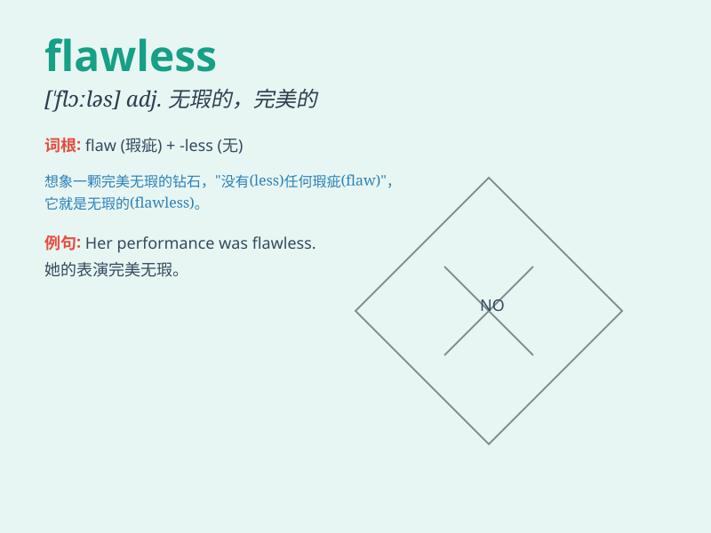

## flawless

**英音:** _[\'flɔːləs]_ **美音:** _[\'flɔləs]_

**译义:** *adj.无瑕疵的,无缺点的,无裂缝的*

### 短语

+ **flawless complexion:** _完美的肤色_

+ **flawless performance:** _完美的表现_

+ **flawless victory:** _完美的胜利_

+ **flawless gem:** _无瑕的宝石_

+ **flawless logic:** _无懈可击的逻辑_

### 例句

#### 例句1

> **The actress gave a flawless performance on the stage.**

**中文翻译:** 这位女演员在舞台上的表演堪称完美。

**单词释义:** 完美无缺的；无瑕疵的

#### 例句2

> **The diamond ring was flawless and extremely valuable.**

**中文翻译:** 这枚钻戒完美无瑕，价值连城。

**单词释义:** 完美的；无缺陷的

#### 例句3

> **Her flawless complexion made her look much younger.**

**中文翻译:** 完美无瑕的肤色让她看起来年轻了很多。

**单词释义:** 无瑕的；无污点的

### 背诵小故事

> A princess was known for her flawless beauty. Her skin was smooth,
her smile charming, and her behavior perfect. Everyone admired her
flawlessness. It means having no flaws or being perfect.

**一位公主以其完美无瑕的美貌而闻名。她的皮肤光滑，笑容迷人，举止完美。每个人都钦佩她的完美无瑕。这个词意味着没有缺陷或完美。**

### 图义

