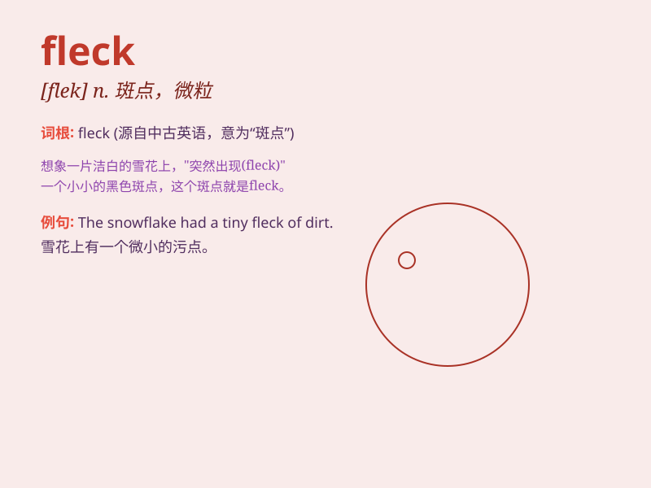

## fleck

**英音:** _[flek]_ **美音:** _[flɛk]_

**译义:**
*n.(皮肤的)斑点,雀斑,斑纹,微粒vt.使起斑点,使有斑纹,使有斑驳*

### 短语

+ **fleck with:** _用...使有斑点_

+ **fleck out:** _使呈现斑点；使有斑驳_

+ **fleck of color:** _一点色彩；少许颜色_

+ **fleck of dust:** _一点灰尘；少许尘埃_

+ **fleck of paint:** _一点油漆；少许涂料_

### 例句

#### 例句1

> **There were flecks of paint on the floor.**

**中文翻译:** 地板上有油漆斑点。

**单词释义:** 斑点；微粒

#### 例句2

> **The horse has flecks of white on its coat.**

**中文翻译:** 这匹马的皮毛上有白色的斑点。

**单词释义:** 斑点

#### 例句3

> **She wiped the flecks of dust from her glasses.**

**中文翻译:** 她擦掉眼镜上的灰尘。

**单词释义:** 微粒

### 背诵小故事

> A young artist was painting a beautiful landscape. Suddenly, a fleck
of paint dropped on the canvas, but she turned it into a shiny star. The
fleck, though small, added a special charm to the painting.

**一位年轻的艺术家正在画一幅美丽的风景画。突然，一滴颜料斑点落在了画布上，但她把它变成了一颗闪亮的星星。这个斑点虽小，却为这幅画增添了特殊的魅力。**

### 图义

