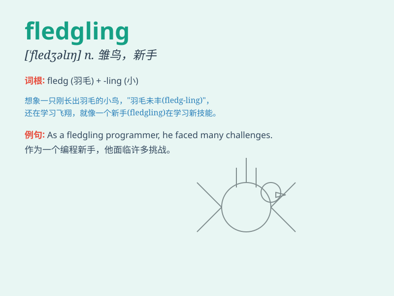

## fledgling

**英音:** _[\'fledʒlɪŋ]_ **美音:** _[\'flɛdʒlɪŋ]_

**译义:** *n.羽毛初长的雏鸟,刚会飞的幼鸟,无经验的人,初出茅庐的人*

### 短语

+ **fledgling industry:** _新兴产业_

+ **fledgling business:** _新成立的企业_

+ **fledgling artist:** _初出茅庐的艺术家_

+ **fledgling writer:** _新手作家_

+ **fledgling democracy:** _新兴民主国家_

### 例句

#### 例句1

> **The fledgling company is still in the process of establishing
itself in the market.**

**中文翻译:** 这家羽翼未丰的公司仍处于在市场上站稳脚跟的过程中。

**单词释义:** 刚起步的

#### 例句2

> **The fledgling bird struggled to fly for the first time.**

**中文翻译:** 这只雏鸟第一次飞翔时很吃力。

**单词释义:** 羽翼未丰的

#### 例句3

> **He is a fledgling writer with great potential.**

**中文翻译:** 他是一位很有潜力的初出茅庐的作家。

**单词释义:** 初出茅庐的

### 背诵小故事

> A little bird was a fledgling, learning to fly. It kept falling but
never gave up. Finally, it soared high in the sky. Remember, a fledgling
is a young and inexperienced creature learning new skills.

**一只小鸟还是一只羽翼未丰的雏鸟，正在学习飞翔。它不断掉落但从不放弃。最后，它在天空中高高翱翔。记住，fledgling
指的是年轻且缺乏经验、正在学习新技能的生物。**

### 图义

