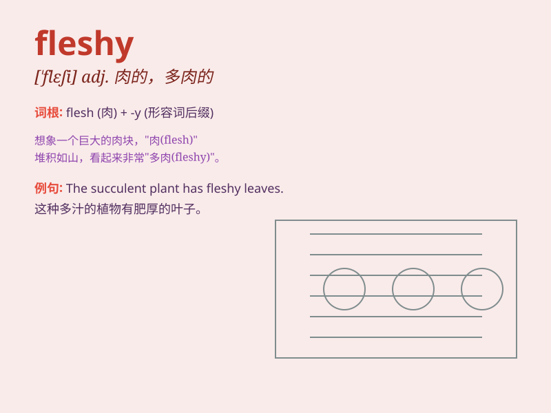

## fleshy

**英音:** _[\'fleʃɪ]_ **美音:** _[\'flɛʃi]_

**译义:** *adj.肉的,肉体的,[植]肉质的,丰满的*

### 短语

+ **fleshy fruit:** _肉质果_

+ **fleshy texture:** _肉质的质地_

+ **fleshy leaves:** _肉质的叶子_

+ **fleshy body:** _多肉的身体_

+ **fleshy stem:** _肉质的茎_

### 例句

#### 例句1

> **The fruit has a fleshy texture and a sweet flavor.**

**中文翻译:** 果实肉质肥厚，味道香甜。

**单词释义:** 肉质的

#### 例句2

> **She has fleshy arms and legs.**

**中文翻译:** 她有肉肉的手臂和腿。

**单词释义:** 多肉的

#### 例句3

> **The plant has fleshy leaves that store water.**

**中文翻译:** 这种植物有肉质的叶子，可以储存水分。

**单词释义:** 肉状的

### 背诵小故事

> A monster had a fleshy body. It was soft and plump. But its fleshy
appearance made it move slowly. One day, it decided to exercise to
become stronger and less fleshy.

**一只怪物有着多肉的身体。它又软又胖。但它多肉的外形使它行动缓慢。有一天，它决定锻炼来变得更强壮、不那么多肉。**

### 图义

