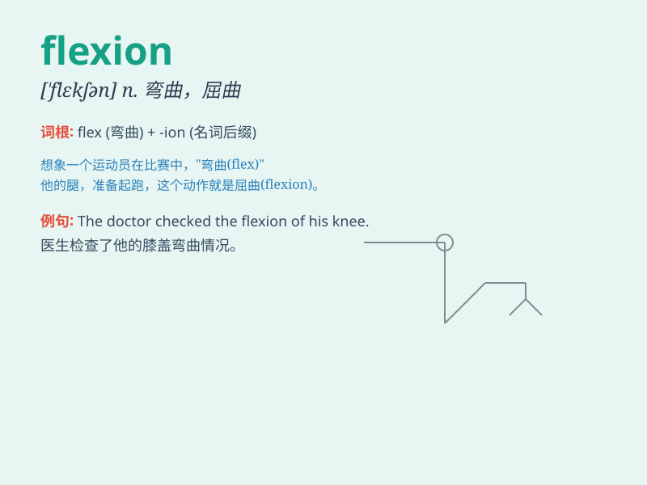

## flexion

**英音:** _[ˈflekʃn]_ **美音:** _[ˈflekʃn]_

**译义:** *n.[解](关节,肢的)弯曲,弯曲状态*

### 短语

+ **flexion angle:** _弯曲角度_

+ **flexion contracture:** _屈曲挛缩_

+ **finger flexion:** _手指弯曲_

+ **knee flexion:** _膝关节屈曲_

+ **wrist flexion:** _腕关节弯曲_

### 例句

#### 例句1

> **The flexion of his arm showed his strength.**

**中文翻译:** 他手臂的弯曲显示出他的力量。

**单词释义:** 弯曲；弯曲的动作

#### 例句2

> **The doctor examined the flexion and extension of the patient\'s
knee.**

**中文翻译:** 医生检查了病人膝盖的屈曲和伸展情况。

**单词释义:** 弯曲（的动作）

#### 例句3

> **Flexion of the spine is important in yoga practice.**

**中文翻译:** 脊柱的弯曲在瑜伽练习中很重要。

**单词释义:** 弯曲

### 背诵小故事

> A flexible gymnast was showing amazing flexion in her performance.
She could bend and twist her body easily, demonstrating perfect control.
The audience was impressed by her remarkable flexion skills.

**一位柔韧性很好的体操运动员在表演中展示了惊人的弯曲动作。她能轻松地弯曲和扭转身体，展现出完美的控制能力。观众对她出色的弯曲技巧印象深刻。**

### 图义

