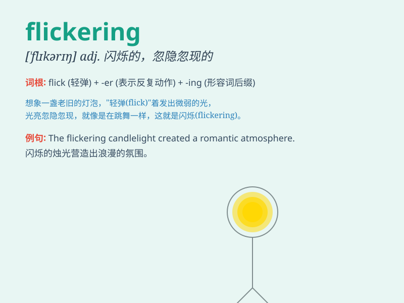

## flickering

**英音:** _[ˈflɪkərɪŋ]_ **美音:** _[ˈflɪkərɪŋ]_

**译义:** *adj.闪烁的,摇曳的,忽隐忽现的,一闪一闪的*

### 短语

+ **flickering light:** _闪烁的光_

+ **flickering flame:** _闪烁的火焰_

+ **flickering image:** _闪烁的图像_

+ **flickering hope:** _渺茫的希望_

+ **flickering shadow:** _闪烁的影子_

### 例句

#### 例句1

> **The flickering candlelight created a romantic atmosphere in the
room.**

**中文翻译:** 摇曳的烛光在房间里营造出浪漫的气氛。

**单词释义:** 闪烁的

#### 例句2

> **The stars were flickering in the sky.**

**中文翻译:** 星星在天空中闪烁。

**单词释义:** 闪烁

#### 例句3

> **The flickering image on the old TV screen was hard to watch.**

**中文翻译:** 旧电视屏幕上闪烁的图像很难看清。

**单词释义:** 闪烁的

### 背诵小故事

> In a dark cave, a small lantern was flickering. The light was
unstable, sometimes bright and sometimes dim, as if it was struggling to
stay alive. This unstable and wavering light is like the meaning of
\'flickering\'.

**在一个黑暗的洞穴里，一盏小灯笼在闪烁。灯光不稳定，时而明亮时而昏暗，仿佛在努力维持着。这种不稳定、摇曳的光就像\'flickering\'的意思。**

### 图义

