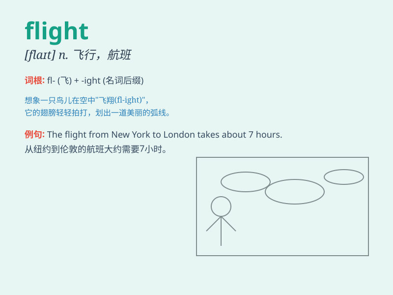

## flight

**英音:** _[flaɪt]_ **美音:** _[flaɪt]_

**译义:**
*n.飞行,逃走,飞跃,飞机的航程,班机,追逐,楼梯的一段,射程vi.成群飞行,迁徙vt.射击(飞禽),使惊飞*

### 短语

+ **flight attendant:** _空中乘务员；航班服务员_

+ **flight path:** _飞行路线；航线_

+ **domestic flight:** _国内航班_

+ **international flight:** _国际航班_

+ **night flight:** _夜间航班_

### 例句

#### 例句1

> **The flight was delayed due to bad weather.**

**中文翻译:** 由于天气恶劣，航班延误了。

**单词释义:** 航班

#### 例句2

> **She took a flight to Paris for her vacation.**

**中文翻译:** 她乘飞机前往巴黎度假。

**单词释义:** 飞行；航班

#### 例句3

> **The bird\'s flight was graceful and smooth.**

**中文翻译:** 这只鸟的飞行优雅而平稳。

**单词释义:** 飞行

### 背诵小故事

> A brave bird was on a long flight. It flew over mountains and rivers,
facing strong winds. But its determination kept it going. Finally, it
reached its destination safely. Remember, \'flight\' means the act of
flying.

**一只勇敢的鸟正在长途飞行。它飞越了山川河流，面对着强风。但它的决心让它继续前进。最后，它安全地到达了目的地。记住，\'flight\'
意思是飞行的行为。**

### 图义

