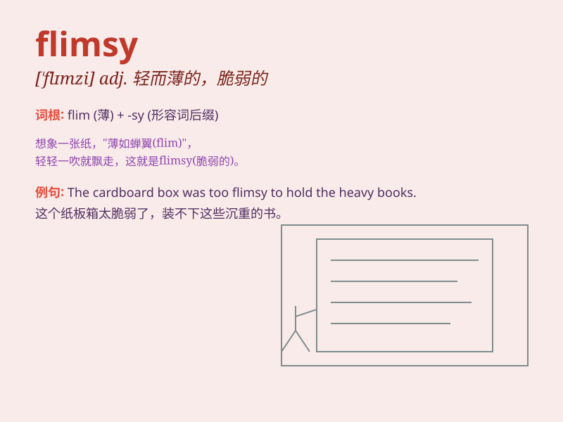

## flimsy

**英音:** _[\'flɪmzɪ]_ **美音:** _[\'flɪmzi]_

**译义:**
*adj.易坏的,脆弱的,浅薄的,没有价值的,不足信的,(人)浮夸的n.薄纸,描图用薄纸,薄纸稿纸*

### 短语

+ **flimsy excuse:** _站不住脚的借口_

+ **flimsy material:** _脆弱的材料_

+ **flimsy evidence:** _薄弱的证据_

+ **flimsy structure:** _不牢固的结构_

+ **flimsy argument:** _无力的论点_

### 例句

#### 例句1

> **The flimsy chair broke when he sat on it.**

**中文翻译:** 当他坐上那张脆弱的椅子时，它就碎了。

**单词释义:** 脆弱的；不结实的

#### 例句2

> **Her excuse was flimsy and unconvincing.**

**中文翻译:** 她的借口站不住脚，缺乏说服力。

**单词释义:** 薄弱的；不足信的

#### 例句3

> **The flimsy fabric tore easily.**

**中文翻译:** 薄薄的布料很容易撕裂。

**单词释义:** 薄的；易损坏的

### 背诵小故事

> A man was selling flimsy umbrellas. When it rained, they broke
easily. People were angry. They said, \'These umbrellas are so weak and
not reliable!\' Now you know \'flimsy\' means weak and easily broken.

**一个男人在卖脆弱的雨伞。下雨时，它们很容易就坏了。人们很生气。他们说：'这些雨伞太脆弱而且不可靠！'现在你知道'flimsy'意思是脆弱的、易坏的。**

### 图义

