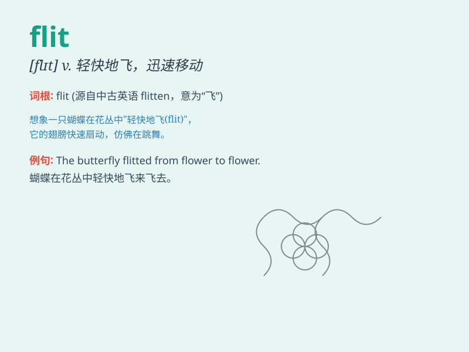

## flit

**英音:** _[flɪt]_ **美音:** _[flɪt]_

**译义:** *n.vi.掠过,迁徙,迅速飞过,(鸟,蝙蝠等)飞来飞去*

### 短语

+ **flit about:** _飞来飞去；到处奔忙_

+ **flit through:** _快速穿过；迅速掠过_

+ **flit from place to place:** _从一个地方飞到另一个地方_

+ **flit in and out:** _进进出出；穿梭往来_

+ **flit between:** _在\...\...之间快速移动_

### 例句

#### 例句1

> **Butterflies flit from flower to flower.**

**中文翻译:** 蝴蝶从一朵花飞到另一朵花。

**单词释义:** 快速飞过，轻快地移动

#### 例句2

> **Thoughts flit through her mind.**

**中文翻译:** 各种念头在她脑海中掠过。

**单词释义:** （想法等）闪现，迅速掠过

#### 例句3

> **He would flit in and out of the room.**

**中文翻译:** 他会飞快地进出房间。

**单词释义:** 迅速地进出

### 背诵小故事

> A little fairy was always seen to flit among the flowers. She moved
quickly and lightly, like a gentle breeze. One day, she decided to flit
to a new garden and bring joy there.

**一个小仙女总是被看到在花丛中轻快地飞来飞去。她移动得又快又轻盈，像一阵微风。有一天，她决定飞到一个新的花园，并在那里带来欢乐。**

### 图义

