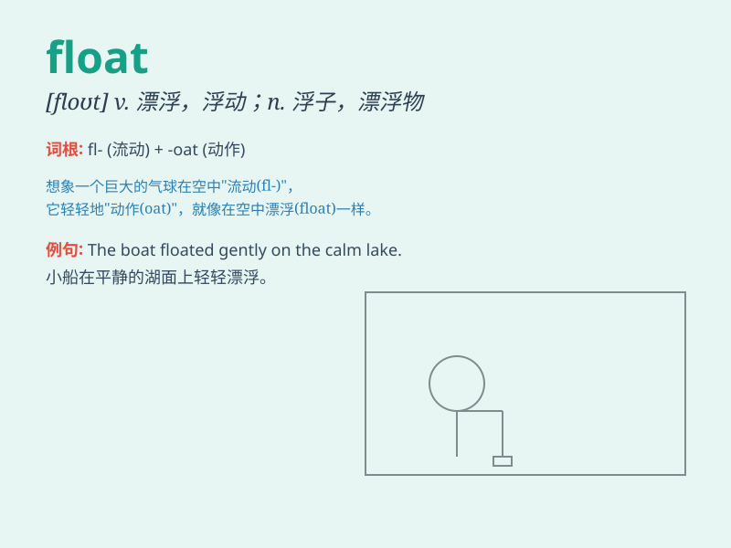

## float

**英音:** _[fləʊt]_ **美音:** _[flot]_

**译义:**
*n.漂流物,浮舟,漂浮,浮萍,彩车vi.浮动,飘浮,散播,摇摆,漂浮,动摇(计划等)付诸实行vt.使漂浮,容纳,淹没,发行,实行,用水注满*

### 短语

+ **float about:** _漂浮；流传_

+ **float on:** _浮在......上_

+ **float away:** _漂走；流逝_

+ **float off:** _（从固体表面）剥落；浮起_

+ **float down:** _顺流而下；飘落_

### 例句

#### 例句1

> **The balloon floated gently up into the sky.**

**中文翻译:** 气球轻轻地飘上了天空。

**单词释义:** 漂浮

#### 例句2

> **She decided to float her idea at the meeting.**

**中文翻译:** 她决定在会上提出她的想法。

**单词释义:** 提出

#### 例句3

> **The company is planning to float shares on the stock market.**

**中文翻译:** 该公司正计划在股票市场上发行股票。

**单词释义:** （使）上市

### 背诵小故事

> A little duck was in the river. It could float easily on the water
and enjoy the beautiful view. Suddenly, a strong wind blew, but the duck
still kept floating safely. \'Float\' means to stay on the surface of a
liquid and move gently.

**一只小鸭子在河里。它能够轻松地浮在水面上欣赏美景。突然，一阵强风吹来，但鸭子仍然安全地漂浮着。\'float\'意思是浮在液体表面并轻轻移动。**

### 图义

