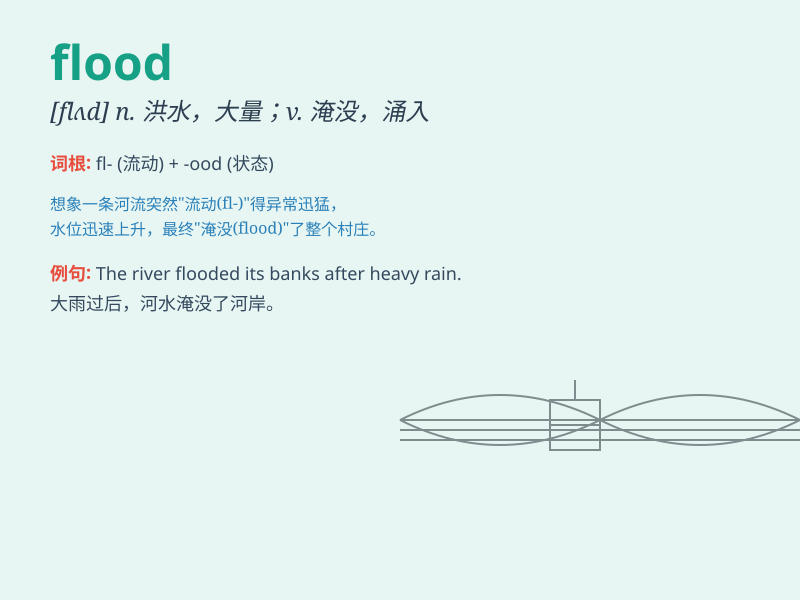

## flood

**英音:** _[flʌd]_ **美音:** _[flʌd]_

**译义:**
*n.洪水,水灾,(因雨)涨潮,[诗]水vt.淹没,使泛滥,注满,充满vi.被水淹,溢出,涌进,喷出,涌出*

### 短语

+ **flood in:** _大量涌入_

+ **flood out:** _因洪水被迫离开_

+ **a flood of:** _大量的；大批的_

+ **flood tide:** _涨潮_

+ **flood plain:** _泛滥平原；洪泛区_

### 例句

#### 例句1

> **The river burst its banks and flooded the town.**

**中文翻译:** 河水决堤，淹没了整个城镇。

**单词释义:** 淹没

#### 例句2

> **The fields were flooded after the heavy rain.**

**中文翻译:** 大雨过后，田地被淹了。

**单词释义:** 使泛滥

#### 例句3

> **We received a flood of complaints.**

**中文翻译:** 我们收到了大量的投诉。

**单词释义:** 大量

### 背诵小故事

> One day, a heavy rain came. The river water rose rapidly and a flood
occurred. Many houses were submerged. People had to escape in boats.
This scene made everyone remember the power of \'flood\'.

**有一天，下起了大雨。河水迅速上涨，发生了洪水。许多房屋被淹没。人们不得不乘船逃生。这个场景让每个人都记住了"洪水"的威力。**

### 图义

