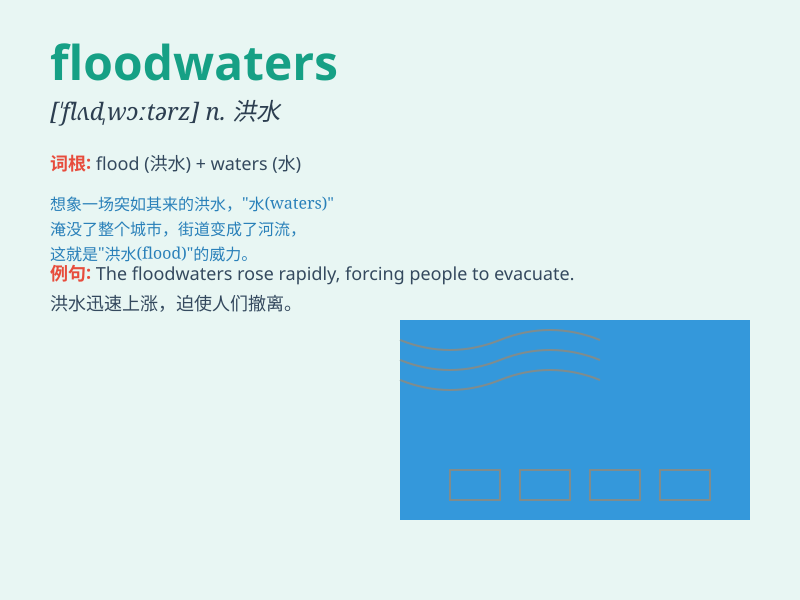

## floodwaters

**英音:** _[flʌdˌwɔːtəz]_ **美音:** _[flʌdˌwɔːtərz]_

**译义:** *n. 洪水（flood的复数形式）；泛滥的洪水*

### 短语

+ **floodwaters recede:** _洪水退去_

+ **floodwaters rise:** _洪水上涨_

+ **floodwaters subside:** _洪水消退_

+ **floodwaters inundate:** _洪水淹没_

+ **floodwaters damage:** _洪水破坏_

### 例句

#### 例句1

> **The floodwaters rose rapidly and inundated the town.**

**中文翻译:** 洪水迅速上涨，淹没了这个城镇。

**单词释义:** 洪水

#### 例句2

> **Rescue teams were working hard to evacuate people from the
floodwaters.**

**中文翻译:** 救援队伍正在努力工作，将人们从洪水中疏散出来。

**单词释义:** 洪水

#### 例句3

> **The floodwaters receded, leaving a trail of destruction in their
wake.**

**中文翻译:** 洪水退去，留下了一片破坏的痕迹。

**单词释义:** 洪水

### 背诵小故事

> A brave man was trapped in a house surrounded by floodwaters. He had
to find a way to escape. The rising floodwaters were terrifying, but he
finally got to safety.

**一个勇敢的人被困在被洪水淹没的房子里。他不得不寻找逃生的办法。不断上涨的洪水很可怕，但他最终到达了安全地带。**

### 图义

