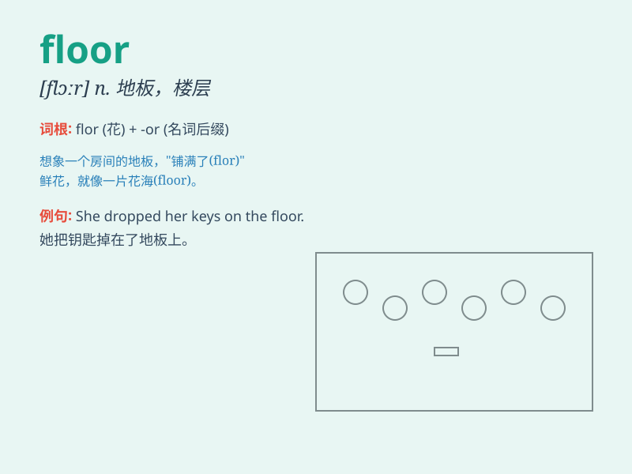

## floor

**英音:** _[flɔː]_ **美音:** _[flɔr]_

**译义:**
*n.(房间,走廊等的)地面,地板,基底,(室内的)场地,层,海底,议员席vt.在\...上铺(地板),击倒,(被困难)难倒*

### 短语

+ **ground floor:** _底层；一楼_

+ **first floor:** _二楼；第一层_

+ **wooden floor:** _木地板_

+ **concrete floor:** _水泥地面；混凝土楼板_

+ **floor lamp:** _落地灯_

### 例句

#### 例句1

> **The floor of the room was covered with a beautiful carpet.**

**中文翻译:** 房间的地板上铺着漂亮的地毯。

**单词释义:** 地板

#### 例句2

> **She swept the floor clean.**

**中文翻译:** 她把地板扫干净了。

**单词释义:** 地板

#### 例句3

> **The first floor of the building is a shopping mall.**

**中文翻译:** 大楼的一楼是一个购物中心。

**单词释义:** 楼层

### 背诵小故事

> A little mouse was running around in a big house. It was very scared
and wanted to find a safe place. Finally, it found a quiet corner on the
floor and felt relieved.

**一只小老鼠在一个大房子里跑来跑去。它非常害怕，想要找一个安全的地方。最后，它在地板上找到了一个安静的角落，松了一口气。**

### 图义

