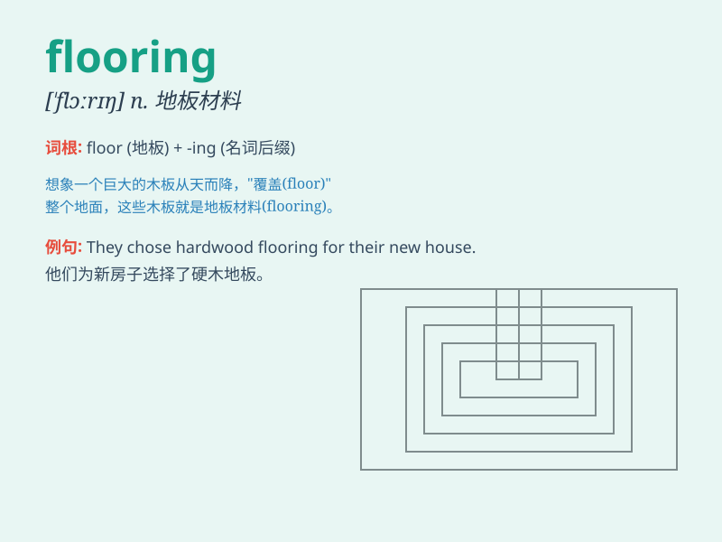

## flooring

**英音:** _[\'flɔːrɪŋ]_ **美音:** _[\'flɔrɪŋ]_

**译义:** *n.[常用作总称]室内地面,地板,地板材料,铺地板*

### 短语

+ **wood flooring:** _木地板_

+ **laminate flooring:** _强化地板_

+ **vinyl flooring:** _乙烯基地板_

+ **stone flooring:** _石材地板_

+ **carpet flooring:** _地毯地板_

### 例句

#### 例句1

> **The new flooring in the living room looks very elegant.**

**中文翻译:** 客厅的新地板看起来非常优雅。

**单词释义:** 地板材料

#### 例句2

> **We need to choose the right flooring for the bathroom to prevent
moisture damage.**

**中文翻译:** 我们需要为浴室选择合适的地板，以防止潮湿损坏。

**单词释义:** 地板材料

#### 例句3

> **The quality of the flooring determines the durability of the
entire space.**

**中文翻译:** 地板的质量决定了整个空间的耐用程度。

**单词释义:** 地板

### 背诵小故事

> One day, Tom was renovating his house. He went to the store and asked
for flooring. The clerk showed him various types. Finally, Tom chose the
beautiful wooden flooring for his living room.

**一天，汤姆在翻新他的房子。他去商店并询问地板材料。店员给他展示了各种各样的类型。最后，汤姆为他的客厅选择了漂亮的木地板。**

### 图义

