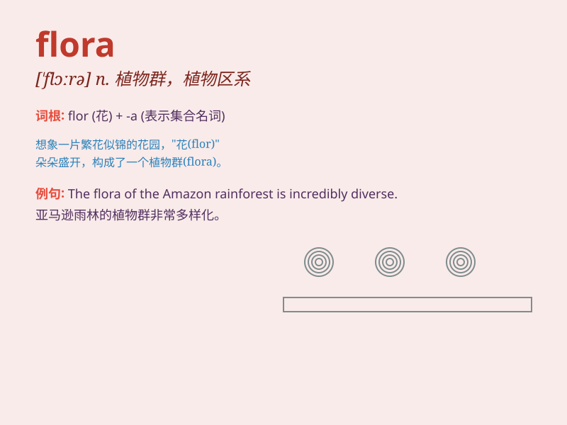

## flora

**英音:** _[ˈflɔːrə]_ **美音:** _[ˈflɔːrə]_

**译义:** *n.[罗神]花神 Flora 弗洛拉(女子名)*

### 短语

+ **flora and fauna:** _动植物_

+ **plant flora:** _植物区系_

+ **native flora:** _本地植物群_

+ **marine flora:** _海洋植物群_

+ **terrestrial flora:** _陆生植物群_

### 例句

#### 例句1

> **The study of the local flora is essential for understanding the
ecosystem.**

**中文翻译:** 对当地植物群的研究对于了解生态系统至关重要。

**单词释义:** 植物群

#### 例句2

> **The botanist was an expert in flora and fauna.**

**中文翻译:** 这位植物学家是动植物方面的专家。

**单词释义:** 植物群

#### 例句3

> **The flora of this region is very diverse.**

**中文翻译:** 该地区的植物群非常多样化。

**单词释义:** 植物群

### 背诵小故事

> In a magical forest, the fairies were naming all the plants. They
decided to call the collection of all the plants \'flora\'. So, whenever
you see the word \'flora\', think of that enchanting forest and its
diverse plants.

**在一个神奇的森林里，仙女们给所有的植物命名。她们决定把所有植物的集合称为'flora'。所以，每当你看到'flora'这个词，就想想那个迷人的森林和它多样的植物。**

### 图义

