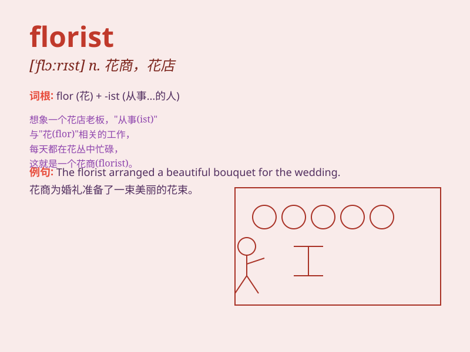

## florist

**英音:** _[\'flɒrɪst]_ **美音:** _[\'flɔrɪst]_

**译义:** *n.种花人*

### 短语

+ **professional florist:** _专业花商_

+ **local florist:** _当地花商_

+ **experienced florist:** _经验丰富的花商_

+ **talented florist:** _有才华的花商_

+ **independent florist:** _独立花商_

### 例句

#### 例句1

> **I bought a beautiful bouquet from the florist near my office.**

**中文翻译:** 我从办公室附近的花店买了一束漂亮的花束。

**单词释义:** 花店店主；花商

#### 例句2

> **The florist arranged the flowers in a lovely vase.**

**中文翻译:** 花店把花插在一个可爱的花瓶里。

**单词释义:** 花店店主；花商

#### 例句3

> **She decided to become a florist because of her love for
flowers.**

**中文翻译:** 出于对花的热爱，她决定成为一名花艺师。

**单词释义:** 花店店主；花商

### 背诵小故事

> One day, Lily wanted to buy some beautiful flowers. So she went to a
shop where a friendly person named Tom was. Tom, the florist, knew all
about different flowers and helped Lily choose the perfect ones.

**有一天，莉莉想买一些漂亮的花。于是她去了一家店，店里有个友好的人叫汤姆。汤姆，这位花商，熟知各种不同的花，并帮助莉莉挑选了最完美的花。**

### 图义

