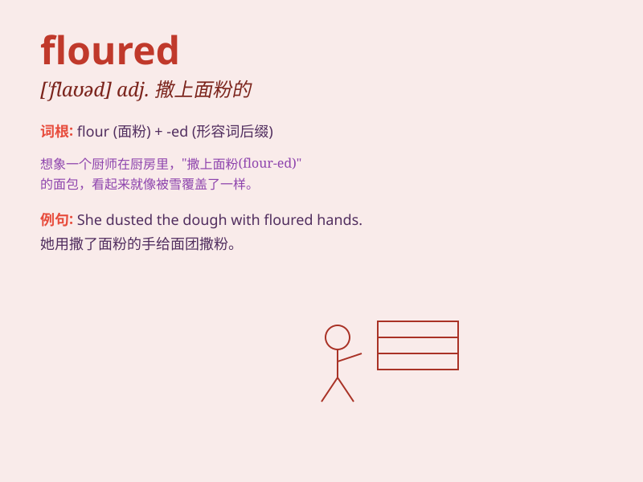

## floured

**英音:** _[ˈflaʊəd]_ **美音:** _[ˈflaʊərd]_

**译义:** *adj. 撒上面粉的；用面粉覆盖的*

### 短语

+ **floured surface:** _撒了面粉的表面_

+ **floured hands:** _沾了面粉的手_

+ **floured board:** _撒了面粉的板子_

+ **floured dough:** _撒了面粉的面团_

+ **floured pan:** _撒了面粉的平底锅_

### 例句

#### 例句1

> **She floured the baking pan to prevent the cake from sticking.**

**中文翻译:** 她在烤盘上撒了面粉以防止蛋糕粘连。

**单词释义:** 撒面粉于

#### 例句2

> **The chef floured the countertop before rolling out the dough.**

**中文翻译:** 厨师在擀面团之前在台面上撒了面粉。

**单词释义:** 撒面粉于

#### 例句3

> **He carefully floured the fish before frying it.**

**中文翻译:** 他在炸鱼之前仔细地给鱼裹了面粉。

**单词释义:** 给\...\...撒面粉；给\...\...裹面粉

### 背诵小故事

> One day, I decided to bake a cake. I opened the cupboard and found
the bag of flour. I carefully poured it onto the counter and it became a
floured surface. Now I could start making my delicious cake!

**有一天，我决定烤一个蛋糕。我打开橱柜，找到了那袋面粉。我小心地把它倒在台面上，台面就变成了撒上面粉的样子。现在我可以开始做美味的蛋糕啦！**

### 图义

