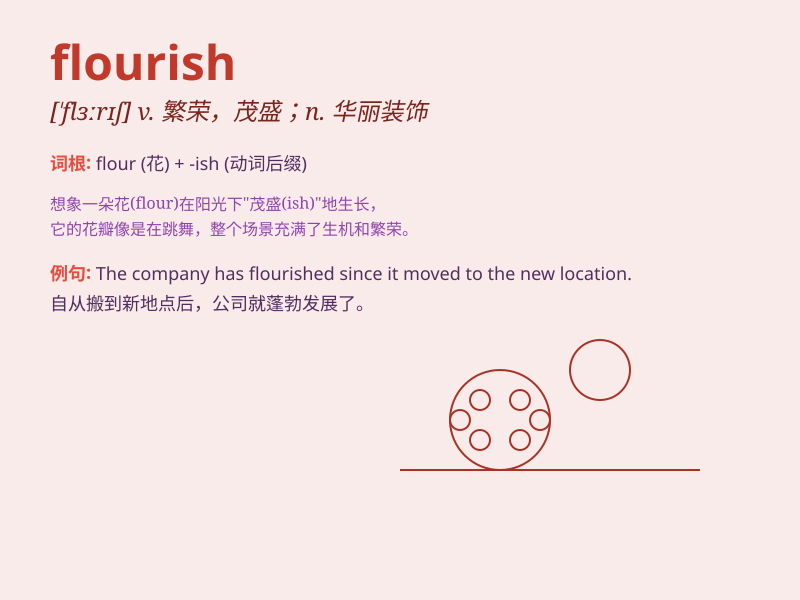

## flourish

**英音:** _[\'flʌrɪʃ]_ **美音:** _[ˈflɜrɪʃ]_

**译义:**
*vi.繁荣,茂盛,活跃,手舞足蹈,兴旺,处于旺盛时期vt.挥动,夸耀n.茂盛,兴旺,华饰,繁荣*

### 短语

+ **flourish and thrive:** _繁荣昌盛_

+ **flourish of pen:** _文笔优美_

+ **flourish in business:** _生意兴隆_

+ **flourish of art:** _艺术繁荣_

+ **flourish of music:** _音乐繁荣_

### 例句

#### 例句1

> **The business is flourishing under his leadership.**

**中文翻译:** 在他的领导下，生意蒸蒸日上。

**单词释义:** 繁荣；兴旺

#### 例句2

> **She flourished her diploma in front of me.**

**中文翻译:** 她在我面前炫耀着她的文凭。

**单词释义:** 挥动；挥舞

#### 例句3

> **The art of calligraphy flourished in the Tang Dynasty.**

**中文翻译:** 唐代书法艺术盛极一时。

**单词释义:** 繁荣；昌盛

### 背诵小故事

> In a magical garden, beautiful flowers flourish. They dance in the
wind, showing their vibrant colors. The word \'flourish\' means to grow
or develop in a healthy and vigorous way, just like these blooming
flowers.

**在一个神奇的花园里，美丽的花朵茂盛生长。它们在风中舞动，展现出鲜艳的色彩。单词\'flourish\'意思是健康、旺盛地成长或发展，就像这些盛开的花朵。**

### 图义

