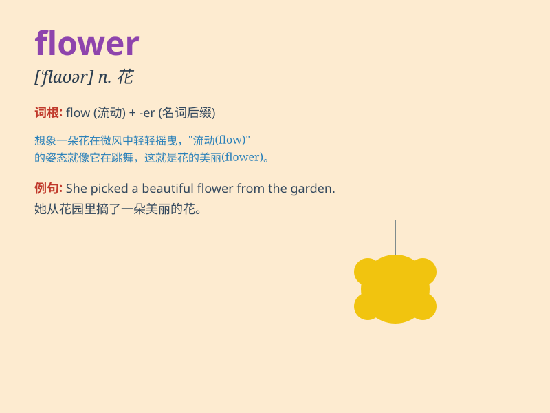

## flower

**英音:** _[\'flaʊə]_ **美音:** _[\'flaʊɚ]_

**译义:**
*n.花,开花的植物,花卉,精华,盛时vi.开花,旺盛,成熟vt.用花装饰,使开花*

### 短语

+ **flower bed:** _花坛；花床_

+ **flower girl:** _卖花女；婚礼中持花的女孩_

+ **flower power:** _（20 世纪 60
年代西方出现的主张通过爱和非暴力实现社会变革的）权力归花的信仰_

+ **flower shop:** _花店_

+ **wild flower:** _野花_

### 例句

#### 例句1

> **The garden is full of beautiful flowers.**

**中文翻译:** 花园里开满了美丽的花朵。

**单词释义:** 花（名词，指植物的花朵）

#### 例句2

> **She received a bouquet of flowers on her birthday.**

**中文翻译:** 她在生日那天收到了一束鲜花。

**单词释义:** 花（名词，指一束花）

#### 例句3

> **The flower of youth is fleeting.**

**中文翻译:** 青春之花转瞬即逝。

**单词释义:** 花（名词，比喻青春、美好的事物）

### 背诵小故事

> A little girl was lost in a forest. Feeling sad and scared, she
suddenly saw a beautiful flower. The flower seemed to smile at her,
giving her hope and courage. She followed the flower and found her way
home.

**一个小女孩在森林里迷路了。感到悲伤和害怕时，她突然看到一朵美丽的花。这朵花似乎对着她微笑，给了她希望和勇气。她跟着这朵花找到了回家的路。**

### 图义

